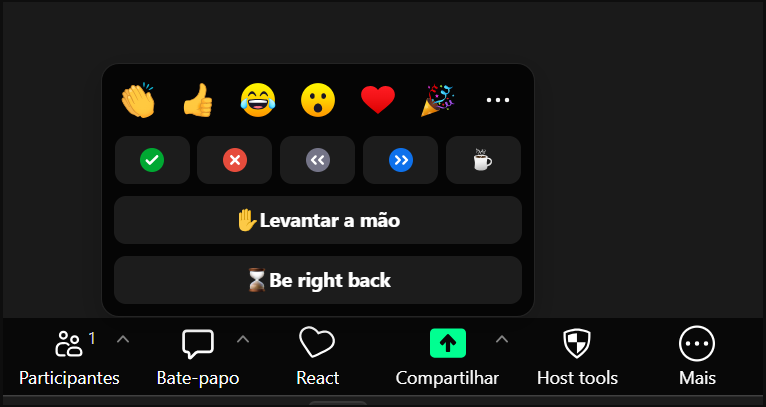
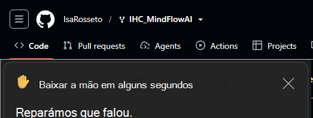
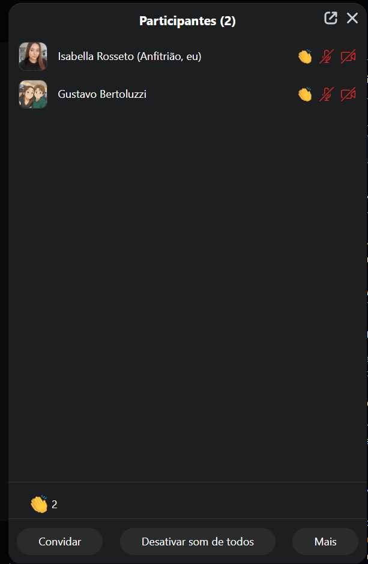
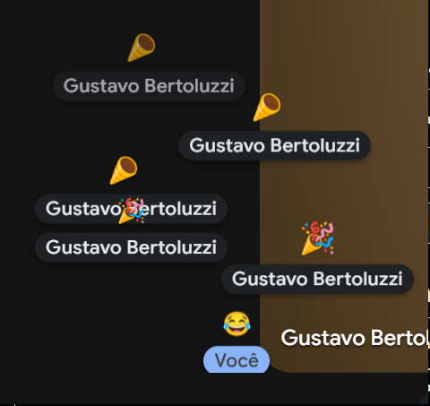
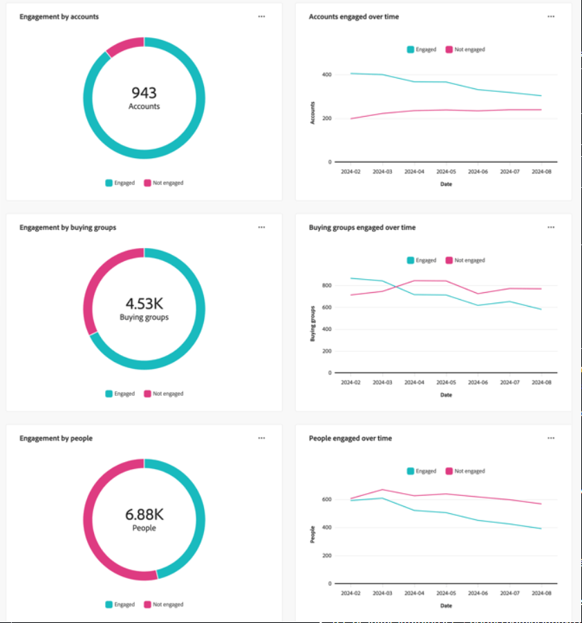
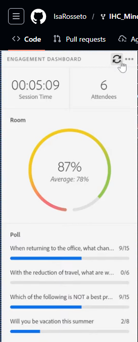
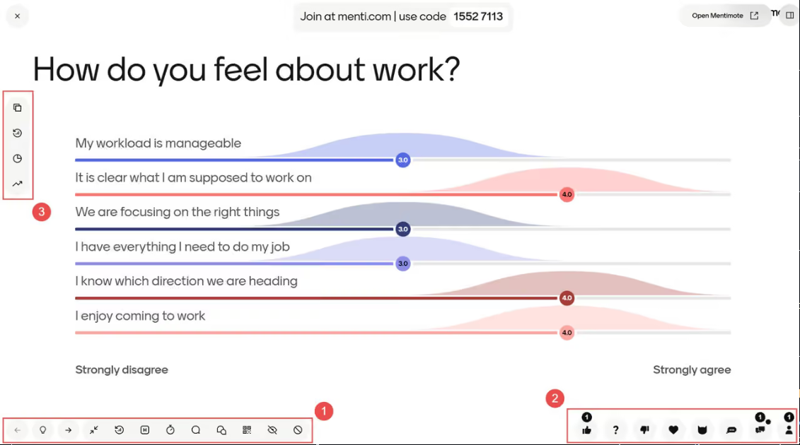

<!-- Consolidação da E2 (03/09/2026), conforme lista de correções da revisão: estrutura e textos fixos = template do professor; análises = texto de cada integrante (ajustes autorizados: renumeração C01–C05, remoção de chaves de template e da coluna ID extra, complementos curtos marcados com comentário). Fusões (público-alvo, 3.1, síntese, RCs) preservam as frases originais de cada autor, realocadas. -->

# Entrega 2 — Público-alvo e análise de concorrência

**Data:** 03/09/2026  
**Status:** 🟩 concluída  
**Responsabilidade mínima:** cada integrante analisa pelo menos 1 concorrente/interface representativa; a equipe produz síntese comparativa.

## Objetivo da atividade

Compreender soluções do mesmo domínio **e também interfaces familiares ao público-alvo**. O objetivo não é copiar telas, mas identificar convenções, padrões, affordances percebidas, problemas recorrentes, expectativas e oportunidades de design.

> **Concorrente não precisa ser idêntico ao produto.** Pode atuar na mesma área, resolver objetivo semelhante ou disputar a mesma necessidade. Quando não houver concorrente direto, use produtos análogos e softwares que o público já utiliza.

### Para TCCs que não previam interface

Não procure apenas um “concorrente do algoritmo”. Investigue **interfaces profissionais que materializam atividades semelhantes** às que o usuário escolhido precisaria realizar.

Exemplos:

- TCC de banco de dados → consoles de administração, ferramentas para DBA, monitoramento e análise de consultas;
- TCC de LLM/ML → painéis de experimentos, gestão de modelos/datasets, comparação de métricas, revisão de resultados;
- TCC de análise de dados → dashboards, ferramentas de BI, filtros, relatórios e exploração;
- TCC de infraestrutura/API → portais administrativos, observabilidade, logs, gestão de credenciais e uso;
- TCC de cibersegurança → consoles de alertas, triagem, histórico e auditoria.

A pergunta é: **“que convenções esse perfil já conhece para executar tarefas equivalentes?”**

## Entrada obrigatória da Entrega 1

Retome o mapa inicial de alternativas e produtos citado na Entrega 1. Aqui a equipe deixa de trabalhar apenas com impressão inicial e passa a **investigar sistematicamente** cada solução.

| Item citado na Entrega 1 | Tipo | Por que foi citado | Status inicial | Decisão nesta entrega |
|---|---|---|---|---|
| Read IA | concorrente | Concorrente direto, com quase os mesmos objetivos | F | analisar (C01) |
| Noldus FaceReader | Análogo | É um software onde consegue identificar diversas impressões faciais, como alegria, tristeza, etc... onde nosso software busca tambem fazer a identificação dessas impressões. | F | Analisar (C02) |
| Microsoft Teams Education Insights | concorrente | Painel de engajamento para professores dentro da plataforma de aula | F | analisar (C03) |
| Reações por emoji manuais (Zoom, Google Meet, Teams) | ferramenta cotidiana | Citada na Entrega 1 como alternativa que o comunicador já usa hoje pra sentir o clima da reunião | F | analisar (C04) |
| Adobe Connect Engagement Dashboard | análogo | Painel de engajamento em tempo real exclusivo do apresentador, dentro da plataforma | — (novo) | analisar (C05) |
| "Olhar a grade de câmeras" + enquetes manuais (processo atual) | processo manual | É como o comunicador resolve o problema hoje | H | analisado na Seção 3 (Google Meet, Mentimeter/Slido) |
| Slido / Mentimeter | análogo | Como comunicadores medem a audiência ativamente hoje (enquetes ao vivo) | — (novo) | coberto na Seção 3 (cotidiano) |
| Zoom AI Companion | análogo/cotidiano | Assistente de IA embutido na própria plataforma de reunião | — (novo) | coberto na Seção 3 (cotidiano) |

Se uma hipótese da Entrega 1 for confirmada ou refutada durante esta análise, atualize `H01`, `H02`... em [`../RASTREABILIDADE.md`](../RASTREABILIDADE.md).

## 1. Público-alvo desta análise

Professores, palestrantes, docentes e facilitadores que fazem reuniões online por videoconferência — o **comunicador**, o mesmo definido como usuário prioritário na Entrega 1. É quem usa a interface: acompanha o Semáforo em tempo real e o Dashboard depois, sem tirar a atenção da própria condução da sessão; o participante só fornece dado pela webcam, não vê tela nenhuma. Por isso comparamos com ferramentas que servem esse mesmo perfil: alguém que precisa acompanhar o estado de um grupo, ao vivo ou depois, e decidir algo em cima disso.

## 2. Concorrentes diretos/indiretos

### Análise C01 — Read AI

**Autor(a):** Kayky Pires - 22.222.040-2  
**Tipo:** direto 
**Link oficial:** [Read IA](https://www.read.ai/pt) 
**Data de acesso:** 26/08/2026

#### Contexto e proposta

Read é o seu copiloto de IA — transformando reuniões, e-mails e mensagens em resumos, insights e respostas instantâneas em todos os dispositivos, onde quer que você trabalhe.

#### Funcionalidades relevantes

| Funcionalidade | Como é realizada | Evidência/print | Observação de IHC |
|---|---|---|---|
| Transcrição da Reunião | O Read AI registra e transcreve automaticamente as falas da reunião, separando o conteúdo por participante. | [Trasncrição](https://github.com/IsaRosseto/IHC_MindFlowAI/blob/main/assets/02_concorrencia/Transcri%C3%A7%C3%A3o%20READIA.png) | A organização por participante facilita a compreensão de quem falou e permite consultar rapidamente partes específicas da reunião. |
|Resumo automático|Após a reunião, a IA gera um resumo com os principais assuntos discutidos, decisões, perguntas e pontos relevantes.|[Resumo](https://github.com/IsaRosseto/IHC_MindFlowAI/blob/main/assets/02_concorrencia/Resumo%20READIA.png)|Reduz a quantidade de informação que o usuário precisa analisar e apresenta uma visão geral da reunião de forma mais objetiva|
|Métricas da reunião|O sistema reúne diferentes indicadores de desempenho, como engajamento, sentimento e outras métricas relacionadas à participação e comunicação.|[Metrica](https://github.com/IsaRosseto/IHC_MindFlowAI/blob/main/assets/02_concorrencia/Dash%20READIA.png)|A centralização das métricas em um painel facilita a comparação das informações, mas exige boa hierarquia visual para não sobrecarregar o usuário|

#### Experiência do usuário e opiniões

<!-- complemento da consolidação (03/09) — Kayky, revisar/ajustar: -->
[F] Avaliações e comparativos públicos elogiam a qualidade dos resumos automáticos, mas registram atritos recorrentes: o bot entra na reunião como participante e precisa ser admitido pelo anfitrião, e há relatos de bot entrando em chamadas mesmo após o usuário tentar desativá-lo (comparativo MeetGeek, "Read AI Pricing Explained", acesso 30/08/2026). [H] Para o nosso contexto, indica que a automação agrega valor, mas a percepção de invasão é o principal atrito de adoção.

#### Preço/modelo de negócio

Utiliza o modelo freemium, oferecendo um plano gratuito limitado a 5 reuniões por mês e planos pagos por usuário. Atualmente, o plano Pro custa a partir de US$ 15/mês por usuário no pagamento anual, enquanto os planos Enterprise e Enterprise+ oferecem recursos adicionais para equipes e organizações

#### Padrões e tendências percebidos

Apresenta tendência de centralizar, em um único painel, transcrição, resumo, métricas de engajamento, sentimento e destaques da reunião. Também se percebe forte uso de inteligência artificial para reduzir o esforço de análise do usuário e transformar reuniões longas em informações visuais e objetivas.

#### Pontos positivos, limitações e lições

| Ponto | Evidência | Implicação para nosso projeto |
|---|---|---|
| Visualização de engajamento e sentimento da reunião. | Dashboard do Read AI. | Possui função semelhante ao MindFlow, sendo necessário diferenciar o projeto pelo foco educacional e pelos estados afetivo-cognitivos analisados. |

---

### Análise C02 — Noldus FaceReader

**Autor(a):** Rafael Dias - 22.222.039-4  
**Tipo:** Análogo  
**Link oficial:** [Noldus FaceReader](https://noldus.com/facereader)  
**Data de acesso:** 26/08/2026

#### Contexto e proposta

Noldus FaceReader - É um produto que realiza a identificação das reações faciais dos usuarios capturando em tempo real ou por videos, demonstrando como as pessoas reagem ao seu produto

#### Funcionalidades relevantes

| Funcionalidade | Como é realizada | Evidência/print | Observação de IHC |
|---|---|---|---|
| Análise automática de expressões faciais | Detecta expressões como felicidade, tristeza, raiva, surpresa, medo, nojo, desprezo e estado neutro, indicando também a intensidade de cada expressão | [Identificação](https://github.com/IsaRosseto/IHC_MindFlowAI/blob/main/assets/02_concorrencia/evidencia_noldus.png) | ele Gera um indicador com o nivel de confiança para cada reação facilitando a demonstração a quem utiliza |

#### Experiência do usuário e opiniões

<!-- complemento da consolidação (03/09) — Rafael, revisar/ajustar: -->
[F] A literatura metodológica sobre o FaceReader (Büdenbender et al., Technological Forecasting & Social Change, 2023) discute limites práticos do uso: sensibilidade a iluminação e ângulo do rosto, diferenças individuais de expressão e a necessidade de tratar a saída como estimativa, não como medida direta. [H] Para o nosso projeto, reforça que classificação facial em uso real exige indicador visível de qualidade/confiança do sinal.

#### Preço/modelo de negócio

O Noldus FaceReader é um software comercial B2B, vendido a partir de licenças, principalmente para laboratorios, univesidades, empresas e instituições de pesquisa. O Noldus oferece 3 tipos de licenças: Essential - € 2000, Advanced - € 9000 e Premium - € 12500. Além dessas versões existe uma versão gratuita de 14 dias.

#### Padrões e tendências percebidos

Demonstra uma tendência para usos de estudo, para entender como os usuarios reagem a produtos ou areas de ensino. Tendo alto nivel de resultados para cada expressão.

#### Pontos positivos, limitações e lições

| Ponto | Evidência | Implicação para nosso projeto |
|---|---|---|
| Identificação da reação das pessoas | Graficos demonstrando o nivel de confiança da emoção (Execução do software) | Possui a funcionalidade parecida com a do nosso projeto de identificar a emoção dos usuarios, demonstrando um farol cognitivo captura em tempo real. |

---

### Análise C03 — Microsoft Teams Education Insights

**Autor(a):** Matheus Ferreira de Freitas — 22.125.085-5  
**Tipo:** concorrente indireto (analytics educacional dentro da plataforma de aula)  
**Link oficial:** https://support.microsoft.com/en-us/topic/educator-s-guide-to-insights-in-microsoft-teams-27b56255-90c0-47aa-bac3-1c9f50157181  
**Data de acesso:** 30/08/2026

#### Contexto e proposta

O Education Insights é o painel de dados do Teams for Education: dá ao docente uma visão por turma (e uma visão geral de todas as turmas) sobre **atividade digital** dos alunos — presença em reuniões, posts em canais, edição de arquivos de classe, entrega e notas de tarefas, progresso de leitura (Reading Progress) e check-ins emocionais autodeclarados (Reflect). A apresentação usa "spotlights": cartões que destacam pontos que merecem atenção ("aluno X sem atividade há N dias"), com visualizações de tendência (guia do educador, acesso 30/08/2026).

#### Funcionalidades relevantes

| Funcionalidade | Como é realizada | Evidência/print | Observação de IHC |
|---|---|---|---|
| Painel por turma + visão geral de todas as turmas | Dashboards nativos no Teams | `../assets/02_concorrencia/insights-educator-guide.png` (PENDENTE — guia do educador, link acima) | Padrão "resumo primeiro, detalhe depois" — bom para o nosso pós-sessão |
| Spotlights (destaques automáticos) | Cartões que apontam quem/o que precisa de atenção | guia do educador | Tradução de dado em **chamada para ação** — inspiração direta para as notificações do Semáforo |
| Métricas de engajamento por ações | Presença em reunião, posts, edição de arquivos, entregas | guia do educador | Mede **comportamento digital**, não estado cognitivo: presença ≠ atenção |
| Reflect (check-in emocional) | Aluno autodeclara como se sente, periodicamente | guia do educador | Estado emocional entra só por autodeclaração pontual — nada em tempo real durante a aula |
| Transparência para o aluno | Página oficial "quais dados o Insights coleta sobre você" | https://support.microsoft.com/en-us/teams/education/quick-start/student-transparency-in-insights-data-collected-to-support-you (acesso 30/08/2026) | Padrão de governança que o MindFlow deveria imitar para tratar a H03 |

#### Experiência do usuário e opiniões

**[F]** A própria documentação delimita o que **não** é coletado (chats privados, OneDrive pessoal, dados de login), e há uma página dedicada a explicar ao aluno o que é coletado — sinal de que vigilância percebida é uma preocupação real do produto. **[H]** Interpretação: para o nosso público (a professora que conduz a aula), o Insights responde "quem está participando das atividades?", mas não responde "a turma está me acompanhando **agora**?" — a decisão em sala continua às cegas.

#### Preço/modelo de negócio

**[F]** Incluído no Teams for Education (licenças A1/A3/A5 institucionais); dados de engajamento digital exportáveis na versão Premium (documentação Microsoft, acesso 30/08/2026). A adoção é decidida pela instituição, não pelo professor — padrão relevante para o perfil de coordenação/gestão, que é quem decide a adoção institucional.

#### Padrões e tendências percebidos

Spotlight cards; visões agregadas com drill-down; tendências temporais; linguagem de "apoio ao aluno" (não de vigilância); transparência documentada para o titular dos dados.

#### Pontos positivos, limitações e lições

| Ponto | Evidência | Implicação para nosso projeto |
|---|---|---|
| Spotlights transformam métrica em ação sugerida | guia do educador | Nosso alerta deve vir com sugestão de ação (pausa/enquete/reexplicar), como o Semáforo já prevê |
| Proxy de engajamento por ações digitais | guia do educador | Lacuna que o MindFlow ataca: estado cognitivo em tempo real vs. rastro de atividade (sustenta H04) |
| Nada de estado em tempo real durante a reunião | guia do educador | Confirma o espaço do trilho de tempo real |
| Página de transparência para o aluno | doc. de transparência | Criar equivalente no MindFlow: o participante vê o que é (e o que não é) processado — responde H03 (RC05) |

---

### Análise C04 — Reações por emoji manuais (Zoom / Google Meet / Teams)

**Autor(a):** Isabella Rosseto - 22.222.036-0
**Tipo:** análogo  
**Link oficial:** [Zoom Support](https://support.zoom.com/) e [Google Meet Help](https://support.google.com/meet/)  
**Data de acesso:** 27/08/2026

#### Contexto e proposta

> As reações por emoji são um recurso nativo das principais plataformas de videoconferência (Zoom, Google Meet, Microsoft Teams). A proposta é simples, o participante clica num ícone (aplausos, joinha, mão levantada etc.) e esse ícone aparece brevemente pra todo mundo ver, sem precisar interromper quem está falando. É a forma mais comum hoje de dar um sinal não verbal numa reunião online, e foi o que a equipe já tinha citado como alternativa atual na Entrega 1.

#### Funcionalidades relevantes

| Funcionalidade | Como é realizada | Evidência/print | Observação de IHC |
|---|---|---|---|
| Reação temporária | No Zoom, o participante clica no botão Reactions e escolhe entre 11 emojis padrão. O ícone aparece do lado do nome do participante na lista e some sozinho depois de 10 segundos | | O tempo curto (10s) evita poluir a tela, mas também significa que se o comunicador não estiver olhando naquele instante, perde o sinal |
| Reação persistente | Ícones como "Levantar a mão" e "Sim/Não" ficam fixos até o próprio participante ou o host removerem manualmente |  | Só esse tipo de reação dá um sinal confiável de estado sustentado, o resto é só um pulso rápido |
| Contagem agregada por ícone | O Zoom mostra, acima de cada ícone, o número total de pessoas que reagiram daquele jeito | | É o único lugar onde existe uma leitura agregada do grupo, mas só conta quem decidiu clicar, não reflete quem está de fato engajado ou confuso |
| Badge no vídeo + explosão de emoji na tela | No Google Meet, a reação aparece como um selo no canto do vídeo da pessoa e sobe flutuando pela tela, com várias reações ao mesmo tempo aparecendo como uma explosão de emojis |  | Reforça a reação como algo visual e rápido, mas ainda depende inteiramente de ação manual do participante |

#### Experiência do usuário e opiniões

Use avaliações públicas, relatos, estudos, testes próprios ou outra fonte identificável. Não trate opinião isolada como verdade universal.

> Segundo a própria documentação do Google Workspace, o objetivo declarado das reações é oferecer uma forma leve e não disruptiva de participar da reunião sem interromper quem está falando. Não achamos, nessa busca inicial, pesquisa de usuário publicada medindo se essa forma de sinal realmente ajuda o apresentador a perceber o clima do grupo, fica como uma lacuna a investigar melhor.

#### Preço/modelo de negócio

<!-- complemento da consolidação (03/09) — Isabella, revisar/ajustar: -->
[F] Recurso nativo e sem custo adicional das próprias plataformas (Zoom, Google Meet, Microsoft Teams) — a disponibilidade acompanha o plano da plataforma de reunião, não há licença própria para as reações (documentações oficiais, acesso 03/09/2026).

#### Padrões e tendências percebidos

> Ícone pequeno, temporário e não bloqueante é o padrão dominante. A diferença entre reação temporária (10 segundos, some sozinha) e persistente (fica até alguém remover) parece ser a única forma que essas plataformas já usam pra distinguir reação pontual de estado sustentado, o que é justamente o problema que o Semáforo Cognitivo do MindFlow tenta resolver de um jeito automático, sem depender do participante escolher manter o ícone ativo.

#### Pontos positivos, limitações e lições

| Ponto | Evidência | Implicação para nosso projeto |
|---|---|---|
| Reação some sozinha em poucos segundos, não polui a tela | Zoom, expiração de 10s | O Semáforo Cognitivo também deveria evitar acumular informação antiga na tela, sempre mostrar o estado mais recente |
| Contagem agregada acima de cada ícone já é um padrão aceito pra ler o grupo de relance | Zoom, contador por ícone | Reforça que um resumo agregado simples, tipo porcentagem do grupo em cada estado, é uma leitura que esse público já sabe interpretar |
| Depende inteiramente de ação manual do participante | Descrição de uso em ambas plataformas | É exatamente a limitação que o MindFlow resolve ao captar sinal passivo pela webcam, sem exigir clique de ninguém |
| Host pode ligar/desligar o recurso pra reunião inteira | Toggle de reações do Google Meet | O MindFlow provavelmente também vai precisar de um controle parecido, dar ao comunicador a opção de ativar ou não o Semáforo Cognitivo numa sessão específica |

---

### Análise C05 — Adobe Connect Engagement Dashboard

**Autor(a):** Gustavo Bertoluzzi 22.123.016-2  
**Tipo:** análogo  
**Link oficial:** https://helpx.adobe.com/adobe-connect/using/viewing-data-meetings.html  
**Data de acesso:** 27/08/2026

#### Contexto e proposta

> [F] O Adobe Connect é uma plataforma de webinars, salas de aula virtuais e reuniões corporativas, mais voltada pra treinamento e apresentação do que pra reunião comum. Dentro dela existe um recurso chamado Engagement Dashboard, disponível como um "pod" que só o apresentador/host enxerga (fica numa área exclusiva do apresentador, os participantes não veem). Ele calcula um score de engajamento em tempo real a partir de interações mensuráveis, como resposta a enquete, uso do chat e reações, e mostra esse score com um indicador visual por cor.

#### Funcionalidades relevantes

| Funcionalidade | Como é realizada | Evidência/print | Observação de IHC |
|---|---|---|---|
| Indicador de engajamento por cor, em tempo real | Score calculado a partir de interações (enquete, chat, reação); score maior ou igual a 60 é "alto engajamento", menor que 20 é "baixo engajamento" ||É praticamente o mesmo conceito do Semáforo Cognitivo, um número complexo por trás, traduzido em uma cor simples pra leitura rápida durante a sessão |
| Relatório minuto a minuto pós-sessão | Depois do evento, fica disponível um relatório detalhado mostrando a variação do engajamento ao longo do tempo, permitindo cruzar com o conteúdo apresentado em cada minuto || É praticamente o mesmo objetivo do Dashboard pós-sessão do MindFlow, achar qual trecho específico gerou queda de engajamento |
| Rastreamento por papel/função | O apresentador pode filtrar o engajamento por tipo de participante (todos, ou por papel específico) | `../assets/02_concorrencia/adobe-connect-tracking.png` (PENDENTE) | Mostra um nível de granularidade a mais que o MindFlow ainda não previu, pode virar uma possibilidade futura pra turmas grandes com subgrupos |

#### Experiência do usuário e opiniões

> [?] Não encontramos avaliação pública de usuário específica sobre esse recurso nesta busca inicial, a documentação consultada é oficial, da própria Adobe. Fica como uma lacuna a investigar melhor, talvez em fóruns de administradores de treinamento corporativo ou reviews do Adobe Connect como um todo.

#### Preço/modelo de negócio

> [F] O Engagement Dashboard só está disponível a partir da versão 12.8 do Adobe Connect, dentro do plano corporativo da ferramenta, não é um produto avulso, é um recurso dentro de uma licença maior.

#### Padrões e tendências percebidos

> [H] Uso de cor como atalho visual pra engajamento, sem precisar interpretar número, separação clara entre visão do apresentador e visão do participante, e relatório pós-sessão organizado por linha do tempo pra permitir cruzar engajamento com o conteúdo daquele momento específico.

#### Pontos positivos, limitações e lições

| Ponto | Evidência | Implicação para nosso projeto |
|---|---|---|
| Indicador por cor é exatamente o padrão que já tínhamos escolhido pro Semáforo Cognitivo | Faixas de score High/Low com cor associada | Valida a escolha de design feita na Entrega 1, esse padrão já é reconhecido no mercado de ferramentas de apresentação/treinamento |
| O engajamento é calculado a partir de interação explícita (enquete, chat, reação), não de sinal visual/facial | Descrição da métrica do Adobe Connect | Essa é a maior diferença real do MindFlow, ele não depende do participante agir, o que resolve exatamente a limitação que fez a equipe escolher captar sinal facial/postural pela webcam |
| Relatório organizado por linha do tempo pós-sessão | Minute-by-minute engagement report | Reforça que a timeline é um padrão esperado no Dashboard pós-sessão do MindFlow, não uma invenção sem precedente |
| Recurso só disponível em plano corporativo, dentro de uma versão específica | Requisito de versão 12.8+ | Vale considerar se o MindFlow vai ficar preso a um modelo de licença parecido ou se vai ser mais acessível, isso pode virar diferencial de adoção |

> Repita a subseção para C02, C03... até atender à quantidade da equipe.

## 3. Softwares que o público-alvo usa no cotidiano

Analise interfaces que moldam a expectativa do público, mesmo que não sejam concorrentes.

| Software | Por que o público usa | Padrões relevantes | Prints | O que aprender |
|---|---|---|---|---|
| Microsoft Teams | Para realizar aulas, reuniões e compartilhar materiais. | Menus laterais, abas, ícones conhecidos e organização dos participantes. | [Teams](https://github.com/IsaRosseto/IHC_MindFlowAI/blob/main/assets/02_concorrencia/Accordion%201.png) | Manter navegação simples e informações importantes de fácil acesso. |
| Google Meet | Para realizar videoconferências e aulas on-line. | Interface limpa, poucos controles e ações principais bem destacadas. | [Meet](https://github.com/IsaRosseto/IHC_MindFlowAI/blob/main/assets/02_concorrencia/meet.jpg) | Evitar excesso de informações e priorizar as funções principais. |
| Google Classroom | Para organizar atividades, materiais e comunicação com alunos. | Organização por turmas, cards e divisão do conteúdo em seções. | `../assets/02_concorrencia/classroom.png` (PENDENTE) | Utilizar blocos bem organizados para facilitar a localização das informações. |
| Mentimeter / Slido | Pra medir compreensão do público em um momento específico da aula ou apresentação | Tela cheia com resultado em tempo real (barra, nuvem de palavras), geralmente compartilhada com o público | | Mostra que esse público já está acostumado a interromper a sessão pra checar entendimento, o MindFlow se diferencia por não precisar dessa pausa |
| Zoom | Ferramenta de videochamada mais usada em aula/reunião | Reactions agregadas pro host; "Attention Tracking" foi removido em 2020 por pressão de privacidade [F] | `../assets/02_concorrencia/zoom-reactions.png` (PENDENTE) | Público aceita feedback agregado, mas rejeita rastreamento individual explícito |
| Kahoot! | Quiz gamificado de revisão em aula | Leaderboard ao vivo + relatório pós-jogo com erros da turma [F] | `../assets/02_concorrencia/kahoot-report.png` (PENDENTE) | Relatório pós-sessão já é familiar pro público |

## 3.1 Padrões de interface relevantes ao escopo de IHC

Registre somente padrões encontrados nas soluções analisadas e que possam ter relação com objetivos reais da equipe.

| Padrão observado | Produto(s) | Para qual tarefa serve | Vantagem percebida | Risco/limitação | Aplicável ao nosso escopo? |
|---|---|---|---|---|---|
| dashboard | Read AI; Noldus FaceReader; Adobe Connect, Mentimeter, Kahoot! | Visualizar métricas e informações gerais da reunião. · Demonstração dos niveis cognitivos · Mostrar o estado do grupo em tempo real de forma rápida (cor/gráfico) | Centraliza os principais dados em uma única tela. · Identifica qual a confiança para cada reação · Leitura instantânea, sem interpretar número cru | O excesso de indicadores pode dificultar a interpretação. · Excesso de informações e dificil entendimento · Host pode confiar demais no indicador sem saber a confiança do dado por trás | Sim / sim |
| relatório | Read AI; Noldus FaceReader; Adobe Connect (minuto a minuto), Kahoot! (pós-jogo) | Consultar resumo, transcrição, engajamento, sentimento e destaques da reunião. · Para avaliar os resultados das reações dos participantes · Entender depois o que aconteceu e cruzar com o conteúdo | Facilita a análise após o término da reunião. · Os relatorios geração não são estruturados de forma gerencial · Vira ação pra próxima sessão, não só constatação | Pode apresentar muitas informações ao mesmo tempo. · Os dados são gerados em forma de excel, tendo que estruturar o tudo · Se não for bem filtrado, gera dado demais sem direção clara | Sim / Talvez / sim |
| histórico + filtros | Read AI; Noldus FaceReader; Adobe Connect (filtro por papel/função, PENDENTE evidência) | Localizar e consultar reuniões anteriores. · Consegue filtrar participantes por nome, nome da análise, combinação participante/análise, gênero e idade. Também pode selecionar somente determinados estímulos ou marcadores de evento e escolher quais parâmetros deseja visualizar · Revisar engajamento por subgrupo/período | Facilita o acesso a resultados passados. · Flexibilidade para filtrar itens expecificos a serem vistos · Granularidade pra achar quem/quando precisa de atenção | Muitos filtros podem aumentar a complexidade da interface. · Expõe usuarios expecificos · Individualizar dado tensiona com a decisão de privacidade do MindFlow | Sim / Sim/Não / talvez, só agregado por tempo, não por pessoa |
| administração/CRUD | Read AI; Noldus FaceReader | Gerenciar reuniões, usuários e configurações da conta. · Gerenciamento de projetos, adicionar novos participantes, excluir novos participantes e editar os dados deles | Permite organizar e controlar os dados da plataforma. · Manutenção e controle de quem esta em cada projeto | Não é uma funcionalidade central para o objetivo do MindFlow AI. · Não observado nos concorrentes analisados até agora | Talvez / Não / não (fora do escopo de IHC) |
| comparação de resultados | Read AI; Noldus FaceReader | Analisar diferenças entre métricas e momentos de uma reunião. · Facilita a comparação entre diferentes resultados das analises feitas | Ajuda a identificar variações de engajamento e sentimento. · Consegue comparar diferentes conjuntos de dados/testes | As métricas podem ser interpretadas de forma equivocada sem contexto. · [?] Nenhum concorrente analisado mostrou comparação clara entre sessões | Sim / Talvez / a investigar |
| indicador temporário/persistente por ícone | Zoom, Google Meet, Teams | Sinalizar um estado pontual ou sustentado sem interromper a fala | Leve, rápido de reconhecer, já é familiar pro público | Depende de ação manual, capta só quem se manifesta | talvez, como referência de linguagem visual, não como mecanismo de captação |
| contagem agregada por tipo de reação | Zoom | Dar uma leitura rápida de quantas pessoas reagiram de cada jeito | Fácil de ler de relance, sem precisar abrir outra tela | Só reflete quem clicou, não o grupo todo | sim, como inspiração pra exibir o "clima" agregado do grupo |

> O objetivo não é concluir “todo concorrente tem dashboard, então teremos um”. O padrão só será adotado se apoiar uma tarefa rastreável.

## 4. Síntese comparativa da equipe

| Critério | C01 | C02 | C03 | C04 | C05 | Oportunidade para o projeto |
|---|---|---|---|---|---|---|
| Navegação | Dashboard organizado por reuniões, relatórios e métricas. | Possui diversas telas, gráficos, tabelas e opções de análise. Apesar de oferecer muitos recursos, a grande quantidade de informações pode tornar a interface complexa e poluída para usuários menos experientes | Painéis por turma dentro do próprio Teams (visão geral + detalhe por aluno/atividade), sem sair da plataforma de aula | Barra de reações fixa nos controles da chamada, acesso direto sem menu extra | Indicador fica dentro do pod, na própria sala, sem precisar trocar de tela | Criar uma navegação simples e com acesso rápido às análises das videoconferências. · Criar uma navegação mais simples, limpa e direta, priorizando as informações mais importantes para o profissional · Manter a leitura no mesmo lugar onde a aula acontece, sem troca de contexto · Manter o Semáforo Cognitivo dentro do próprio fluxo da chamada, sem exigir troca de tela |
| Feedback/estado | Apresenta indicadores de engajamento, sentimento e destaques da reunião. | Apresenta feedback visual durante a análise, mostrando expressões identificadas, intensidade, valência, arousal e qualidade da detecção facial | Spotlights automáticos destacam quem/o que precisa de atenção; estado emocional só por autodeclaração pontual (Reflect) | Ícone temporário (some em 10s) ou persistente (fica até remover), com contagem agregada por tipo | Cor em tempo real (score ≥60 = alto, <20 = baixo engajamento) | Mostrar de forma clara os estados identificados e suas mudanças ao longo da sessão. · Apresentar os estados identificados de maneira clara e de fácil interpretação, destacando alterações importantes ao longo da aula · Transformar dado em chamada de ação (padrão spotlight) — e cobrir o tempo real, que o Insights não cobre · Usar um indicador automático e contínuo, em vez de depender do participante escolher reagir |
| Prevenção/recuperação de erro | Utiliza padrões conhecidos de interface e organização das informações. | Informa problemas durante a análise, como quando não consegue encontrar ou classificar um rosto, além de apresentar um indicador de qualidade da detecção. Porém, alguns problemas exigem que o próprio usuário ajuste câmera, iluminação ou configurações | [?] Não documentado nas fontes consultadas | Participante pode remover a própria reação; host pode limpar todas de uma vez | [?] Não documentado nas fontes consultadas | Usar mensagens claras e elementos visuais que reduzam erros de interpretação. · Fornecer mensagens de erro simples, indicando o problema e sugerindo diretamente como corrigi-lo · Comunicar incerteza/qualidade do sinal para evitar confiança cega na classificação · Pensar em como o comunicador poderia "corrigir" ou ignorar um alerta que pareça equivocado |
| Terminologia | Utiliza termos relacionados a reuniões, engajamento, sentimento e comunicação. | Utiliza diversos termos técnicos, como Action Units, FACS, Valence, Arousal, Stimuli e Event Markers, que podem dificultar o entendimento de usuários sem conhecimento técnico | Linguagem de "apoio ao aluno", sem tom de vigilância; termos do cotidiano escolar | Nomes de emoji comuns, linguagem do dia a dia | "Engagement score", alto/baixo — linguagem simples, traduzida pra cor | Utilizar linguagem simples e próxima da realidade dos docentes. · Utilizar uma linguagem mais próxima do contexto educacional e explicar termos técnicos por meio de descrições, dicas ou tooltips · Adotar o mesmo tom de apoio (nunca de vigilância) nos rótulos do MindFlow · Usar linguagem simples nos rótulos dos estados, evitando termo técnico de IA |
| Acessibilidade | Utiliza gráficos, textos e indicadores visuais para apresentar os dados. | Alto volume de graficos e termos tecnicos, assim dificultando usuarios com baixo nivel tecnico nas informações demonstradas | [?] Não avaliado nesta busca inicial; segue os padrões gerais do Microsoft 365 | Depende de clique manual, pode ser barreira pra quem tem limitação motora | [?] Não documentado nas fontes consultadas | Evitar depender apenas de cores e combinar gráficos com textos e valores. · Desenvolver e criar visualizações com padrões de acessibilidade e linguagem simples para entendimento de todo o publico · Não depender só de cor no Semáforo (cor + ícone + rótulo) · O MindFlow evita essa barreira por não depender de ação alguma do participante |
| Eficiência | Automatiza transcrição, resumo e análise da reunião em um único ambiente. | Permite automatizar análises faciais, analisar vários dados, comparar participantes e grupos, realizar análises em lote e exportar resultados, reduzindo o trabalho manual do profissional | Métricas coletadas automaticamente do rastro digital (presença, entregas, posts); nada de estado em tempo real durante a aula | Leitura rápida do ícone, mas exige ação ativa do participante a cada sinal | Score calculado automaticamente a partir de interações que já existem (enquete, chat, reação), sem ação extra do host | Automatizar a análise e apresentar ao docente apenas as informações mais relevantes. · Automatizar a análise das aulas e videoconferencias para apresentar ao profissional somente os principais resultados e insights, reduzindo o esforço necessário para interpretar os dados · Automatizar a leitura do grupo ao vivo, preservando o pós-sessão como complemento · Buscar a mesma leitura rápida, sem exigir nenhuma ação do participante |

## 5. Recomendações derivadas

Liste recomendações com origem explícita.

- **RC01:** Criar um dashboard simples e objetivo para visualizar os principais resultados da videoconferência — derivada de **C01 (Read AI)**.

- **RC02:** Desenvolver Dashboard e farol cognitivo em tempo real para identificar pontos de melhoria em apresentações/aulas, além da identificação pontual de perda de atenção do publico - deruvada de **C02 (Noldus FaceReader)**.
- **RC03:** Transformar métrica em chamada de ação para o comunicador, no padrão dos spotlights do Insights (ex.: sugerir pausa ou enquete quando o estado do grupo cair) — derivada de C03 (Teams Education Insights).
- **RC04:** Manter uma página curta de transparência para o participante ("o que é coletado, o que nunca sai do dispositivo"), no padrão da página de transparência do Insights para os alunos — derivada de C03 (Teams Education Insights).
- **RC05:** Não depender de ação manual do participante pra gerar o sinal, diferente das reações por emoji, que exigem clique a cada sinal. O MindFlow deve manter o sinal passivo captado pela webcam, derivada de **C04 (Reações por emoji)**.
- **RC06:** Evitar acumular informação antiga na tela do Semáforo Cognitivo, sempre mostrar o estado mais recente, do mesmo jeito que a reação temporária do Zoom some sozinha depois de alguns segundos, derivada de **C04 (Reações por emoji)**.
- **RC07:** Oferecer ao comunicador um controle simples pra ligar ou desligar o Semáforo Cognitivo na sessão, do mesmo jeito que o host pode ligar ou desligar as reações no Google Meet, derivada de **C04 (Reações por emoji)**.
- **RC08:** Usar um indicador de cor simples (sem exigir leitura de número) no Semáforo Cognitivo — derivada de C05.
- **RC09:** Manter o indicador visível só para o comunicador, sem expor nada aos participantes — derivada de C05.
- **RC10:** Estruturar o Dashboard pós-sessão como linha do tempo (minuto a minuto), pra permitir cruzar quedas de engajamento com o conteúdo apresentado naquele momento — derivada de C05.

## Referências

<!-- Kayky (C01): -->
https://www.read.ai/pt

<!-- Rafael (C02): -->
[Pagina inicial](https://noldus.com/facereader)
[Documentação](https://noldus.com/shared/resources/book/noldus-product-documentation/chapter/facereader)

<!-- Matheus (C03): -->
- Microsoft. *Educator's guide to Insights in Microsoft Teams.* https://support.microsoft.com/en-us/topic/educator-s-guide-to-insights-in-microsoft-teams-27b56255-90c0-47aa-bac3-1c9f50157181 — acesso 30/08/2026.
- Microsoft. *Student transparency in Insights.* https://support.microsoft.com/en-us/teams/education/quick-start/student-transparency-in-insights-data-collected-to-support-you — acesso 30/08/2026.
- Microsoft Learn. *IT Admin Guide to Education Insights.* https://learn.microsoft.com/en-us/microsoftteams/class-insights — acesso 30/08/2026.
- MeetGeek. *Read AI Pricing Explained.* https://meetgeek.ai/blog/read-ai-pricing — acesso 30/08/2026 (fonte do complemento de C01).
- Büdenbender et al. *Methodological considerations for FaceReader.* Technological Forecasting & Social Change, 2023. https://www.sciencedirect.com/science/article/pii/S0040162523005747 — acesso 30/08/2026 (fonte do complemento de C02).

<!-- Isabella (C04): -->
- Zoom Support. Reactions in a Zoom Meeting. https://support.zoom.com/ (acesso em 27/08/2026)
- Google Meet Help. Use reactions in a video call. https://support.google.com/meet/ (acesso em 27/08/2026)

<!-- Gustavo (C05): -->
**Adobe Connect (C05)**
- Adobe. *Engagement dashboard pod.* https://helpx.adobe.com/adobe-connect/using/engagement-dashboard-pod.html
- Adobe. *View the session dashboard.* https://helpx.adobe.com/adobe-connect/using/session-dashboard.html
- Adobe. *Measurable business impact — Adobe Connect.* https://www.adobe.com/products/adobeconnect/measurable-business-impact
- Adobe. *What's new in Adobe Connect — Fall Release 2024* (PDF, com prints do dashboard). https://www.adobe.com/content/dam/cc/us/en/products/adobe-connect/fall-release-2024/Whats_new_in_Adobe_Connect_Fall_Release.pdf

**Zoom**
- Zoom. *A Message to Our Users* (CEO Eric Yuan, remoção do Attention Tracking). https://blog.zoom.us/wordpress/2020/04/01/a-message-to-our-users/
- Arizona State University. *April 1, 2020 - Zoom Update.* https://tech.asu.edu/april-1-2020-zoom-update
- University of Michigan. *Reactions in a Zoom Meeting.* https://teamdynamix.umich.edu/TDClient/30/Portal/KB/Article/3805/Reactions-in-a-Zoom-Meeting

**Mentimeter**
- Purdue University. *Mentimeter — Online Teaching Hub.* https://onlineteachinghub.education.purdue.edu/mentimeter/
- K20 Center. *Mentimeter — Authentic Lessons for 21st Century Learning.* https://learn.k20center.ou.edu/tech-tool/645

**Kahoot!**
- University of Colorado Boulder. *Kahoot! — Research & Innovation Office.* https://www.colorado.edu/researchinnovation/kahoot
- Purdue University. *Kahoot! — Online Teaching Hub.* https://onlineteachinghub.education.purdue.edu/kahoot/

## Checklist

- [x] O mapa inicial de alternativas da Entrega 1 foi revisitado e aprofundado.
- [ ] Hipóteses relevantes sobre mercado/padrões foram atualizadas na rastreabilidade quando surgiram evidências.
- [x] Há pelo menos uma análise completa por integrante.
- [x] Cada análise contém prints legíveis da interface.
- [x] Prints mostram telas/estados relevantes, não apenas logos/homepage.
- [x] Foram analisados concorrentes e/ou interfaces representativas ao público.
- [x] Em TCC sem interface original, foram investigadas ferramentas profissionais análogas às atividades do usuário escolhido.
- [x] Padrões como dashboard, relatório, filtros e CRUD foram analisados como soluções para tarefas, não como requisitos automáticos.
- [x] Opiniões de UX têm fonte.
- [x] A síntese compara critérios comuns e produz recomendações.
- [x] Não há “copiar porque o concorrente faz”; há justificativa de adequação ao público/contexto.
