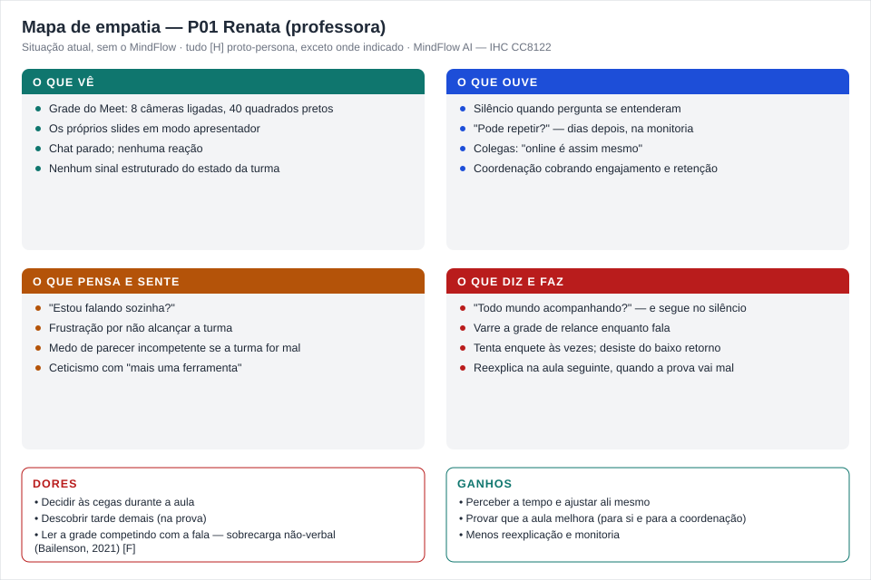

# Entrega 3 — Personas, mapa de empatia, contexto de uso e jornada

**Data:** {{dd/mm/aaaa}}  
**Status:** 🟨 em andamento  
**Responsabilidade:** 1 persona por integrante; 1 mapa de empatia, 1 contexto de uso consolidado e 1 jornada por equipe (salvo orientação diferente do docente).

## Objetivo da atividade

Representar grupos de usuários de forma útil para decisões de design. Persona não é personagem decorativo: suas características devem alterar requisitos, prioridades, linguagem, fluxos ou critérios de avaliação.

## Atenção a projetos técnicos

Em TCCs sem interface original, a persona pode representar um **profissional que se apropria da contribuição técnica**: DBA, analista, cientista de dados, administrador, pesquisador, técnico, operador, gestor ou especialista de domínio.

Não escolha um perfil apenas porque "parece combinar" com a tecnologia. Explique **qual objetivo esse perfil teria e qual parte da contribuição do TCC produziria valor para ele**. Se ainda for hipótese, mantenha como hipótese/proto-persona a validar.

Também considere papéis diferentes quando houver tarefas distintas, por exemplo:

- operador que executa análises;
- administrador que configura e gerencia permissões;
- especialista que interpreta resultados;
- gestor que consulta relatórios e decide;
- auditor que revisa histórico.

## Entradas da Entrega 1

Antes de criar personas, retome os tipos de usuários, características relevantes, objetivos e hipóteses registradas na Entrega 1. A persona **não deve transformar uma hipótese inicial em fato por meio de uma história fictícia**.

| Item da Entrega 1 | Status inicial | Evidência disponível agora | Como será tratado nesta entrega |
|---|---|---|---|
| Comunicador (professor/instrutor/palestrante/facilitador) como usuário prioritário | H | Entrega 1, itens 2.2 e 7.2 | incorporar, essa persona representa o comunicador em contexto de aula de idioma |
| Objetivo do comunicador de perceber o grupo em tempo real sem tirar a atenção da condução | H | Entrega 1, item 7.3 | incorporar diretamente nos objetivos e na jornada da persona |
| H01, comunicador acha útil um indicador discreto em tempo real, sem virar distração | H, aberta | RASTREABILIDADE.md | manter como hipótese, a persona é construída assumindo que H01 é verdadeira, mas isso ainda precisa ser validado |
| H02, comunicador precisa ver o nível de confiança do modelo pra não confiar cegamente numa classificação errada | H, aberta | RASTREABILIDADE.md | manter como hipótese, vira uma necessidade explícita da persona, não um fato consolidado |
| Turma pequena (5 a 15 alunos), citada agora pela equipe como recorte específico pra esta persona | H | não constava na Entrega 1, é um recorte novo desta entrega | investigar, precisa ser confirmado se esse tamanho de turma muda a forma como o comunicador usaria o Semáforo Cognitivo |

## 1. Personas

### Persona P01 — Camila Duarte

**Autor(a):** Isabella Rosseto - 22.222.036-0
**Tipo:** primária  
**Base de evidências:** proto-persona a validar, construída a partir das hipóteses e do usuário definido na Entrega 1, ainda sem entrevista real  
**Hipóteses da Entrega 1 relacionadas:** H01, H02

| Campo | Descrição |
|---|---|
| Faixa etária / contexto relevante | 34 anos |
| Ocupação/papel | Professora de inglês, dá aula em uma escola de idiomas e também turmas particulares por conta própria |
| Conhecimento do domínio | Alta, é formada em Letras e tem certificação internacional de proficiência, domina bem o conteúdo que ensina |
| Experiência tecnológica | Mediana, usa bem o Zoom, Google Meet e ferramentas básicas de apresentação, mas não é alguém que acompanha lançamento de tecnologia por hobby |
| Objetivos | Manter a turma engajada durante a aula toda, mesmo sendo online, e perceber rápido quando algum aluno está se perdendo no conteúdo |
| Necessidades | Um sinal simples de como a turma está reagindo, sem precisar ficar checando rosto por rosto enquanto fala e compartilha slide |
| Dores/frustrações | Em turmas de 5 a 15 alunos, é fácil um ou dois alunos ficarem confusos sem avisar nada, e ela só percebe isso quando já é tarde, na correção do exercício ou na aula seguinte |
| Motivadores | Ver os alunos evoluindo de verdade no idioma, e sentir que a aula foi bem conduzida, não só que o conteúdo foi passado |
| Restrições/acessibilidade | Nenhuma restrição de acessibilidade conhecida, mas tem pouco tempo entre uma aula e outra, então qualquer ferramenta nova precisa ser rápida de entender |
| Ambiente típico de uso | Dá aula de casa, notebook com webcam, às vezes numa sala silenciosa, às vezes com alguma interrupção doméstica |
| Comportamentos relevantes | Fala bastante durante a aula, compartilha tela com exercícios e slides, e só consegue olhar rapidamente pra grade de vídeo entre uma atividade e outra |

**Decisões de design influenciadas por P01:**

- O Semáforo Cognitivo precisa ser lido de relance, já que Camila está com a atenção dividida entre falar, compartilhar tela e conduzir a aula.
- Como a turma é pequena (5 a 15 alunos), o indicador agregado por grupo precisa continuar fazendo sentido mesmo com poucas pessoas, diferente de uma sala de aula cheia com 40 ou 50 alunos.
- A linguagem da interface não pode usar termo técnico de IA, já que Camila tem experiência tecnológica mediana, não é especialista.
- O nível de confiança da classificação (ligado à H02) precisa aparecer de um jeito simples, porque ela não teria como validar sozinha se o sistema está certo ou errado numa aula de idioma.

> Repita para P02, P03... Cada integrante deve produzir ao menos uma persona.

### Síntese das personas

## 2. Mapa de empatia — equipe

**Persona escolhida:** P01 (Camila Duarte)  
**Justificativa:** É a persona mais detalhada até agora e representa bem o comunicador em uma situação concreta e comum (aula de idioma em turma pequena), o que ajuda a equipe a validar decisões de design num cenário realista antes de generalizar pra outros contextos.

Documente também em texto: o que vê; ouve; diz/faz; pensa/sente; dores; ganhos. Diferencie **evidência** de **hipótese**.

**O que vê [H]:** a própria tela de compartilhamento, uma grade pequena de vídeo no canto, alguns alunos com câmera desligada.

**O que ouve [H]:** os alunos respondendo os exercícios em voz alta, silêncio quando ninguém entende a pergunta, às vezes o próprio som da casa.

**O que diz e faz [H]:** explica a matéria, faz perguntas pra turma, tenta puxar quem está mais quieto, compartilha exercício na tela.

**O que pensa e sente [H]:** preocupação de estar falando sozinha sem saber se a turma está acompanhando, ansiedade de não ter feedback claro durante a aula.

**Dores [H]:** perceber tarde demais que um aluno específico ficou perdido num tópico, não ter como saber se o silêncio da turma é atenção ou desânimo.

**Ganhos/necessidades [H]:** um sinal rápido e confiável do clima da turma, que não a distraia da própria condução da aula.

## 3. Contexto de uso — consolidação

| Dimensão | Descrição | Implicação de design |
|---|---|---|
| Usuários | Comunicador (professor/instrutor/palestrante/facilitador), com a persona P01 representando especificamente professora de idioma em turma pequena (5 a 15 alunos) | A interface precisa funcionar bem tanto pra grupos pequenos quanto pra turmas maiores, sem perder a leitura de "clima do grupo" quando há poucos alunos |
| Tarefas | Perceber o estado do grupo em tempo real durante a aula, e revisar depois quais momentos tiveram mais dificuldade | Justifica o Semáforo Cognitivo (tempo real) e o Dashboard pós-sessão, já definidos na Entrega 1 |
| Equipamentos | Notebook ou desktop com webcam, conexão de internet doméstica, às vezes instável | A interface do tempo real precisa ser leve, sem exigir muito processamento nem depender de conexão perfeita |
| Ambiente físico | Geralmente a casa da professora, nem sempre um espaço silencioso ou bem iluminado | Reforça a decisão já tomada na Entrega 1, de que iluminação ruim pode prejudicar a extração de sinal facial |
| Ambiente social/organizacional | Aula particular ou de escola de idiomas, sem estrutura de TI dedicada por trás | A ferramenta precisa ser simples de configurar sozinha, sem depender de suporte técnico |
| Papéis/permissões/governança | Só a professora vê o Semáforo Cognitivo e o Dashboard, os alunos não têm acesso a nenhuma tela do sistema | Confirma a decisão de privacidade já definida na Entrega 1, indicador visível só pro comunicador |
| Volume de dados/histórico | Turma pequena, poucas aulas por semana, histórico relevante seria por turma ou por aluno ao longo do curso | Levanta uma dúvida nova pra investigar, se faz sentido comparar o engajamento da mesma turma entre aulas diferentes |

## 4. Jornada do usuário — equipe

**Persona:** P01 (Camila Duarte)  
**Objetivo da jornada:** Dar uma aula de inglês de 50 minutos pra uma turma de 12 alunos, percebendo a tempo se alguém está confuso ou desengajado, e revisando depois o que deu certo ou não.  
**Início e fim da jornada:** Começa alguns minutos antes da aula, quando ela abre a chamada e ativa o MindFlow, e termina depois da aula, quando ela revisa o Dashboard antes de planejar a próxima aula.

| Etapa | Situação/ação | Objetivo | Pensamento/emoção | Dor | Oportunidade de design | Evidência |
|---|---|---|---|---|---|---|
| 1 | Abre a videochamada alguns minutos antes e ativa o MindFlow | Deixar tudo pronto antes dos alunos entrarem | Tranquila, rotina já conhecida | Nenhuma até aqui | Ativação simples, poucos cliques | H |
| 2 | Começa a aula explicando um tópico novo de gramática | Passar o conteúdo com clareza | Focada na explicação, atenção dividida entre falar e compartilhar tela | Não consegue olhar a grade de vídeo com atenção | O Semáforo Cognitivo precisa ser visível sem que ela precise procurar por ele na tela | H |
| 3 | O indicador mostra sinal de confusão crescente no grupo | Perceber que algo não está sendo entendido | Alerta, mas ainda incerta se deve confiar no sinal | Medo de interromper a aula à toa por um alerta errado | Mostrar o nível de confiança da classificação, ligado à hipótese H02 | H |
| 4 | Ela para, dá um exemplo extra e pergunta se a turma entendeu | Resolver a confusão percebida antes de seguir em frente | Mais segura, sente que agiu a tempo | Nenhuma, esse é o momento em que a ferramenta cumpriu o propósito dela | Confirma o valor central do Semáforo Cognitivo, definido desde a Entrega 1 | H |
| 5 | Termina a aula e depois abre o Dashboard pra revisar | Entender quais momentos tiveram mais dificuldade, pra ajustar a próxima aula | Curiosa, quer aprender com a própria condução | Pode não ter tempo sobrando entre uma aula e outra pra revisar com calma | O Dashboard precisa ser rápido de ler, tipo um resumo, não um relatório longo | H |

> A jornada pode incluir etapas **antes, durante e depois** do uso do produto. Não transforme a jornada em lista de telas.

## Síntese

A partir da persona P01 e da jornada, alguns pontos precisam obrigatoriamente aparecer nos cenários e nas tarefas das próximas entregas: o Semáforo Cognitivo precisa ser lido sem esforço mesmo com a atenção da professora dividida, o nível de confiança da classificação precisa aparecer de forma simples (ligado à H02), o indicador agregado precisa fazer sentido mesmo em turmas pequenas de 5 a 15 alunos, e o Dashboard pós-sessão precisa ser rápido de consultar, dado o pouco tempo que a professora tem entre uma aula e outra.

## Checklist

- [ ] Existe pelo menos uma persona por integrante. *(só a P01 foi criada até agora)*
- [x] As personas não são apenas diferenças demográficas superficiais.
- [x] Está claro o que é dado real e o que é hipótese/proto-persona.
- [x] A persona não "validou por ficção" uma hipótese da Entrega 1; afirmações continuam marcadas como hipótese quando não há evidência.
- [x] Objetivos e dores têm consequência para o design.
- [x] Contexto de uso está coerente com a Entrega 1.
- [x] Em TCC sem interface original, a persona possui relação explícita com a contribuição técnica. *(não se aplica integralmente, já que o TCC previa interface, mas a persona está ligada à contribuição técnica mesmo assim)*
- [x] Papéis administrativos, técnicos e decisórios só foram criados quando possuem objetivos/tarefas diferentes.
- [x] Jornada possui etapas, dores e oportunidades e não é apenas wireflow.
- [ ] IDs das personas foram adicionados à rastreabilidade. *(falta atualizar o RASTREABILIDADE.md com o ID P01)*
