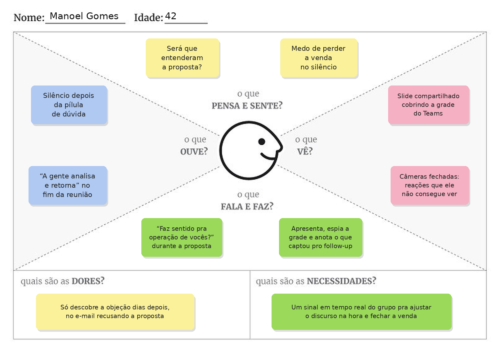

# Entrega 3 — Personas, mapa de empatia, contexto de uso e jornada

**Data:** {{dd/mm/aaaa}}  
**Status:** ⬜ não iniciada  
**Responsabilidade:** 1 persona por integrante; 1 mapa de empatia, 1 contexto de uso consolidado e 1 jornada por equipe (salvo orientação diferente do docente).

## Objetivo da atividade

Representar grupos de usuários de forma útil para decisões de design. Persona não é personagem decorativo: suas características devem alterar requisitos, prioridades, linguagem, fluxos ou critérios de avaliação.

## Atenção a projetos técnicos

Em TCCs sem interface original, a persona pode representar um **profissional que se apropria da contribuição técnica**: DBA, analista, cientista de dados, administrador, pesquisador, técnico, operador, gestor ou especialista de domínio.

Não escolha um perfil apenas porque “parece combinar” com a tecnologia. Explique **qual objetivo esse perfil teria e qual parte da contribuição do TCC produziria valor para ele**. Se ainda for hipótese, mantenha como hipótese/proto-persona a validar.

Também considere papéis diferentes quando houver tarefas distintas, por exemplo:

- operador que executa análises;
- administrador que configura e gerencia permissões;
- especialista que interpreta resultados;
- gestor que consulta relatórios e decide;
- auditor que revisa histórico.

## Entradas da Entrega 1

Antes de criar personas, retome os tipos de usuários, características relevantes, objetivos e hipóteses registradas na Entrega 1. A persona **não deve transformar uma hipótese inicial em fato por meio de uma história fictícia**.

| Item da Entrega 1 | Status inicial | Evidência disponível agora | Como será tratado nesta entrega |
|---|---|---|---|
| {{usuário/objetivo/característica/H01...}} | F / H / ? | {{...}} | incorporar / manter como hipótese / descartar / investigar |

## 1. Personas

### Persona P04 — Manoel Gomes

**Autor(a):** Matheus Ferreira de Freitas — RA 22.125.085-5  
**Tipo:** secundária  
**Base de evidências:** proto-persona a validar, construída a partir das hipóteses da Entrega 1, estendendo o perfil do comunicador para o contexto comercial  
**Hipóteses da Entrega 1 relacionadas:** H01, H03, H04

| Campo | Descrição |
|---|---|
| Faixa etária / contexto relevante | 38–45 anos; vendedor que apresenta propostas e demonstrações por videoconferência (Microsoft Teams) para clientes de outras empresas |
| Ocupação/papel | Executivo de vendas B2B, responsável por conduzir reuniões comerciais com grupos de 3 a 10 participantes do lado do cliente |
| Conhecimento do domínio | Alto no produto e no discurso de venda, com anos de experiência em reunião presencial, onde lia o cliente pelo olhar e pela postura |
| Experiência tecnológica | Média; usa Teams, CRM e slides todos os dias, mas não tem paciência para ferramenta complicada — precisa funcionar sem atrapalhar a reunião |
| Objetivos | Saber, ainda durante a fala, se o cliente está compreendendo e comprando a ideia, para ajustar o discurso na hora e aumentar a chance de fechar a venda |
| Necessidades | Um sinal em tempo real da reação do grupo enquanto apresenta, principalmente logo depois das "pílulas de dúvida" — perguntas curtas que ele solta de propósito para testar se o cliente entendeu e se interessou |
| Dores/frustrações | Hoje, sem a ferramenta, ele tem dificuldade de entender os clientes no mundo virtual: não consegue ver todos na grade do Teams (ainda mais compartilhando tela) e não sabe se estão de fato compreendendo o discurso; muitas vezes interpreta o silêncio como acordo e só descobre a objeção dias depois, quando a proposta é recusada por e-mail |
| Motivadores | Bater meta, encurtar o ciclo de venda e chegar no follow-up sabendo exatamente qual parte da proposta precisa reforçar |
| Restrições/acessibilidade | Apresenta quase sempre com tela compartilhada, o que esconde a grade de vídeo; o tempo da reunião é definido pelo cliente e costuma ser curto; não pode constranger o cliente com cobrança direta de atenção |
| Ambiente típico de uso | Home office ou mesa do escritório, notebook com headset, várias reuniões comerciais por dia no Teams |
| Comportamentos relevantes | Sem a ferramenta, ele conduz assim: apresenta compartilhando a tela, tenta espiar a grade reduzida de vídeo enquanto fala, solta as pílulas de dúvida ("faz sentido para a operação de vocês?", "esse ponto ficou claro?") e, como nem todos aparecem ou respondem, anota o que conseguiu captar e manda e-mail de follow-up tentando adivinhar onde perdeu o cliente |

**Decisões de design influenciadas por P04:**

- O Semáforo Cognitivo precisa ser legível de relance com a tela compartilhada, sem cobrir o material da apresentação — a mesma atenção dividida das demais personas, agora em reunião com cliente.
- O sinal em tempo real precisa reagir rápido o suficiente para mostrar a reação do grupo logo após uma pílula de dúvida, que é o momento em que Manoel decide se avança ou reexplica (H01, H04).
- O sistema deve indicar quantos participantes estão contribuindo para o sinal (câmeras abertas ou não), para Manoel saber o quanto pode confiar no agregado antes de mudar o discurso por causa dele.
- Como os participantes são clientes de outra empresa, o aviso e o consentimento sobre a classificação ficam ainda mais sensíveis (H03) — o uso comercial não pode acontecer sem transparência para os convidados.

**Mapa de empatia — P04 (Manoel Gomes):**

> Repita para P02, P03... Cada integrante deve produzir ao menos uma persona.

### Síntese das personas

Explique diferenças entre os perfis e qual persona é prioritária. Evite personas duplicadas que só mudam nome/foto.

## 2. Mapa de empatia — equipe

**Persona escolhida:** {{P01}}  
**Justificativa:** {{por que esse perfil é relevante}}

Documente também em texto: o que vê; ouve; diz/faz; pensa/sente; dores; ganhos. Diferencie **evidência** de **hipótese**.

## 3. Contexto de uso — consolidação

| Dimensão | Descrição | Implicação de design |
|---|---|---|
| Usuários | {{...}} | {{...}} |
| Tarefas | {{...}} | {{...}} |
| Equipamentos | {{...}} | {{...}} |
| Ambiente físico | {{...}} | {{...}} |
| Ambiente social/organizacional | {{...}} | {{...}} |
| Papéis/permissões/governança | {{...}} | {{...}} |
| Volume de dados/histórico | {{...}} | {{...}} |

## 4. Jornada do usuário — equipe

**Persona:** {{P01}}  
**Objetivo da jornada:** {{...}}  
**Início e fim da jornada:** {{...}}

| Etapa | Situação/ação | Objetivo | Pensamento/emoção | Dor | Oportunidade de design | Evidência |
|---|---|---|---|---|---|---|
| 1 | {{...}} | {{...}} | {{...}} | {{...}} | {{...}} | {{...}} |

> A jornada pode incluir etapas **antes, durante e depois** do uso do produto. Não transforme a jornada em lista de telas.

## Síntese

Quais necessidades e objetivos devem obrigatoriamente aparecer nos cenários e nas tarefas seguintes?

## Checklist

- [ ] Existe pelo menos uma persona por integrante.
- [ ] As personas não são apenas diferenças demográficas superficiais.
- [ ] Está claro o que é dado real e o que é hipótese/proto-persona.
- [ ] A persona não “validou por ficção” uma hipótese da Entrega 1; afirmações continuam marcadas como hipótese quando não há evidência.
- [ ] Objetivos e dores têm consequência para o design.
- [ ] Contexto de uso está coerente com a Entrega 1.
- [ ] Em TCC sem interface original, a persona possui relação explícita com a contribuição técnica.
- [ ] Papéis administrativos, técnicos e decisórios só foram criados quando possuem objetivos/tarefas diferentes.
- [ ] Jornada possui etapas, dores e oportunidades e não é apenas wireflow.
- [ ] IDs das personas foram adicionados à rastreabilidade.
