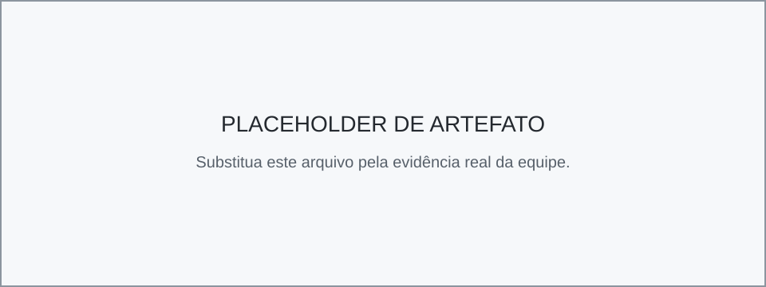
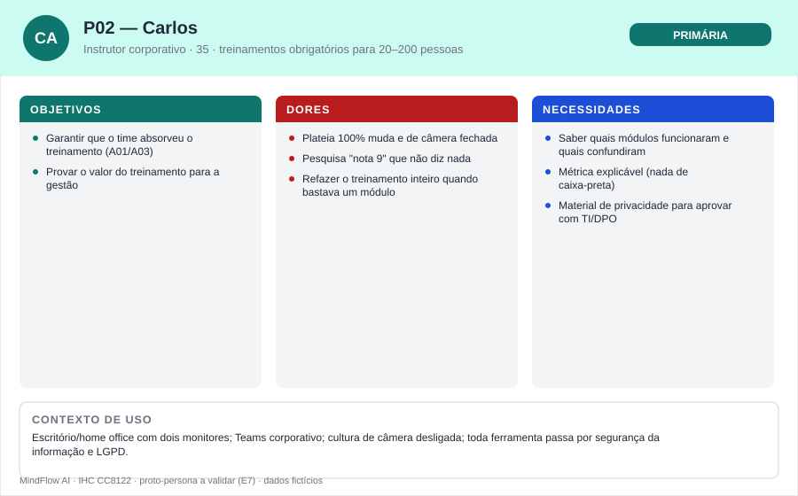
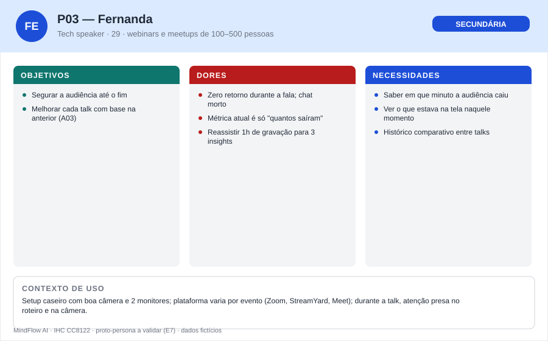
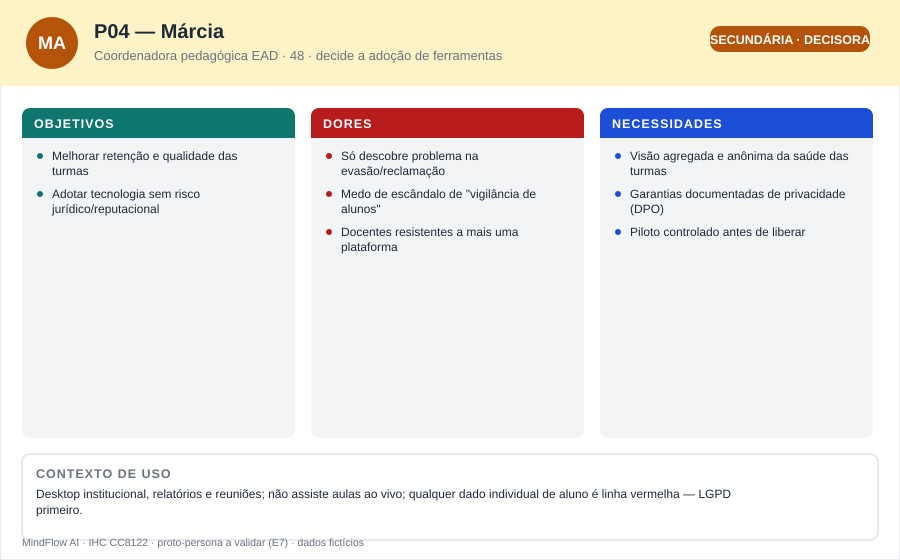
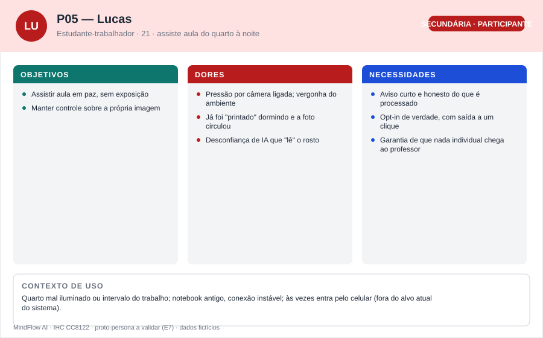

<!-- REVISAR (branch para revisão do grupo): rascunho produzido com apoio de IA a partir das Entregas 1–2,
     do template e do material da disciplina (CC8122-Personas.pdf: perfil estatístico, tipos de persona,
     mapa de empatia, contexto, jornada). Todas as personas são PROTO-PERSONAS a validar na Entrega 7.
     Divisão de autoria é SUGESTÃO. Revisem, ajustem e removam este comentário antes do merge na main. -->

# Entrega 3 — Personas, mapa de empatia, contexto de uso e jornada

**Data:** 31/08/2026  
**Status:** 🟨 em revisão pela equipe  
**Responsabilidade:** 1 persona por integrante; 1 mapa de empatia, 1 contexto de uso consolidado e 1 jornada por equipe.

## Objetivo da atividade

Representar grupos de usuários de forma útil para decisões de design. Persona não é personagem decorativo: suas características devem alterar requisitos, prioridades, linguagem, fluxos ou critérios de avaliação.

## Entradas da Entrega 1

| Item da Entrega 1 | Status inicial | Evidência disponível agora | Como será tratado nesta entrega |
|---|---|---|---|
| Comunicador (professor/instrutor/palestrante) como usuário prioritário (7.2) | H | E2 mostrou que nenhuma ferramenta atual dá leitura de estado em tempo real a esse perfil | Detalhado em P01 (professora), P02 (instrutor corporativo) e P03 (palestrante) — mantido como hipótese até a coleta da E7 |
| Atenção dividida do comunicador durante a sessão (2.4) | H | Reforçada pela análise do modo apresentador e do overlay do Slido (E2, Seção 3/3.1) | Incorporada como restrição central de P01/P02/P03 e da jornada |
| Participante como fonte de dados, com possível desconforto — H03 | H | Página de transparência do Teams Insights e aviso nativo do Zoom mostram que o mercado trata isso como risco real (E2, C03/C05) | P05 criada para representar esse perfil; mantida como hipótese |
| Instituição/DPO como stakeholder que aprova adoção (2.3) | H / ? | Insights é adquirido pela instituição, não pelo professor (E2, C03) | P04 criada como persona secundária decisora |
| A01–A03 (perceber, ajustar, revisar) como atividades centrais (3.2) | H | Padrões da E2 (spotlight, timeline) mapeiam bem para A01–A03 | Objetivos das personas amarrados a A01–A03 |

## 1. Personas

### 1.0 Perfil do usuário — proto-perfis (formato da aula)

Antes das personas, o material da disciplina (CC8122-Personas.pdf, p.3–4) agrupa os usuários em **perfis** de características semelhantes — no exemplo da aula, uma tabela estatística construída a partir de questionário. Ainda **não temos questionário** (planejado para a Entrega 7), então os proto-perfis abaixo são hipóteses [H] da equipe derivadas das Entregas 1–2; percentuais e contagens ficam explicitamente em aberto.

| Característica | Perfil A — comunicador docente | Perfil B — comunicador corporativo/eventos |
|---|---|---|
| % e nº de usuários no perfil | a levantar no questionário da E7 | a levantar no questionário da E7 |
| Faixa etária | [35, 50) [H] | [28, 42) [H] |
| Tempo conduzindo sessões online | [3, 10) anos [H] | [2, 8) anos [H] |
| Frequência de sessões síncronas | 2–3 por semana [H] | 2–4 por mês [H] |
| Frequência de uso de tecnologia | várias vezes ao dia [H] | várias vezes ao dia [H] |
| Experiência com tecnologia (1 = precisa de muita ajuda … 5 = faz tudo sem ajuda) | 3 [H] | 4–5 [H] |
| Atitude perante tecnologia (1 = odeia … 5 = adora) | 3 — usa porque precisa [H] | 4 [H] |
| Estilo de aprendizado | pergunta a colegas; tutorial rápido [H] | aprende fazendo; lê documentação [H] |
| Aplicações mais utilizadas | 1. Meet/Teams, 2. PowerPoint, 3. Moodle/LMS, 4. planilhas [H] | 1. Teams/Zoom, 2. slides, 3. Power BI/dashboards, 4. LMS corporativo [H] |

P01 detalha o Perfil A; P02 e P03 são dois recortes do Perfil B (instrutor interno recorrente × palestrante de evento). P04 e P05 não são comunicadores — entram pela tipologia de personas da aula (p.10): **primárias, secundárias, extremas, negativas e outros stakeholders**.

### Persona P01 — Renata, a professora que fala com quadrados pretos

**Autor(a):** Isabella Vieira Silva Rosseto — 22.222.036-0 *(sugestão)*  
**Tipo:** primária  
**Base de evidências:** proto-persona a validar (literatura da E1: Work Trend Index, Bailenson 2021; situação concreta 4.5 da E1)  
**Hipóteses da Entrega 1 relacionadas:** H01

| Campo | Descrição |
|---|---|
| Lema | “Eu dou aula pra 48 quadrados pretos e torço pra ter alguém do outro lado.” |
| Faixa etária / contexto relevante | 41 anos; professora universitária de exatas em curso noturno, aulas remotas/híbridas desde 2020 |
| Ocupação/papel | Docente; conduz 2–3 aulas síncronas por semana para turmas de 40–60 alunos |
| Conhecimento do domínio | Domina o conteúdo; conhece bem a dinâmica de sala presencial e sente falta dela no online |
| Experiência tecnológica | Intermediária: Meet/Teams, slides, Moodle; não é usuária de dashboards analíticos |
| Objetivos pessoais | Não terminar o semestre com a sensação de ter falado sozinha; ser boa professora também no online |
| Objetivos práticos | Terminar a aula com a turma acompanhando (A01); ajustar o ritmo a tempo quando o grupo se perde (A02) |
| Necessidades | Um sinal confiável e imediato de "a turma está te acompanhando?", que não exija olhar uma segunda tela cheia de números |
| Dores/frustrações | Falar 90 min para câmeras fechadas; descobrir só na prova que a turma se perdeu na aula 5; enquetes tomam tempo e rendem 6 respostas |
| Motivadores | Aula boa de verdade; reconhecimento dos alunos; menos retrabalho de reexplicação depois |
| Restrições/acessibilidade | Atenção dividida (fala + slides + chat); às vezes usa um monitor só; qualquer alerta precisa funcionar em tela única |
| Ambiente típico de uso | Casa/gabinete, notebook com webcam, Meet/Teams + PowerPoint em modo apresentador |
| Comportamentos relevantes | Pergunta "todo mundo entendeu?" e segue no silêncio; olha a grade de câmeras de relance; ignora métricas pós-aula por falta de tempo |
| Tarefas típicas (frequência/duração) | Conduzir 2–3 aulas síncronas de 90 min por semana (crítica); tirar dúvidas no fórum/chat (diária, curta); preparar aulas e corrigir avaliações (semanal) |
| Relacionamentos | Alunos das turmas; coordenação (perfil de P04); colegas docentes; suporte de TI da instituição |
| Expectativas sobre o produto | Que funcione sozinho durante a aula, como o cronômetro do modo apresentador — "se precisar de manual, eu não uso" [H] |

**Decisões de design influenciadas por P01:**

- O sinal ao vivo tem de ser legível em ≤2s, em tela única, sem interpretação de gráfico (RC01).
- O alerta deve sugerir ação concreta (pausa, enquete, reexplicar) — ela não tem folga cognitiva para deduzir (RC07).
- O pós-sessão precisa apontar direto os momentos críticos ligados ao conteúdo, não exigir exploração de dados (RC04).

---

### Persona P02 — Carlos, o instrutor corporativo cobrado por resultado

**Autor(a):** Matheus Ferreira de Freitas — 22.125.085-5 *(sugestão)*  
**Tipo:** primária  
**Base de evidências:** proto-persona a validar (contextos de uso do TCC1; experiência da equipe com treinamentos corporativos)  
**Hipóteses da Entrega 1 relacionadas:** H01, H02

| Campo | Descrição |
|---|---|
| Lema | “Número sem explicação, pra mim, é chute.” |
| Faixa etária / contexto relevante | 35 anos; analista sênior de TI que ministra onboardings e treinamentos obrigatórios (segurança, compliance, ferramentas internas) |
| Ocupação/papel | Instrutor interno; 2–4 sessões por mês, de 20 a 200 participantes, quase todos de câmera desligada |
| Conhecimento do domínio | Alto no conteúdo técnico; médio em didática — dar aula não é a função principal dele |
| Experiência tecnológica | Alta: Teams, dashboards (Power BI), ferramentas de TI; confortável com métricas, desconfiado de números sem explicação |
| Objetivos pessoais | Ser levado a sério como instrutor, mesmo sem ser "professor de carreira" |
| Objetivos práticos | Garantir que o time realmente absorveu o treinamento (A01/A03); provar valor do treinamento para a gestão |
| Necessidades | Saber quais partes do treinamento funcionaram e quais geraram confusão, com evidência que ele possa citar |
| Dores/frustrações | Plateia 100% muda e de câmera fechada; pesquisa de reação no fim ("nota 9") que não diz nada; refazer treinamento inteiro quando bastava refazer um módulo |
| Motivadores | Eficiência; dado que sustente decisão; menos sessões repetidas |
| Restrições/acessibilidade | Ambiente corporativo com restrições de segurança/LGPD — nada de gravar vídeo dos colegas; ferramentas precisam passar pela TI |
| Ambiente típico de uso | Escritório/home office, dois monitores, Teams + slides |
| Comportamentos relevantes | Já usa relatórios do Teams (presença); confere quem concluiu; questiona como a métrica foi calculada antes de confiar nela |
| Tarefas típicas (frequência/duração) | Ministrar 2–4 treinamentos de 60–120 min por mês (crítica); reportar resultados à gestão (mensal); atualizar material (contínua) |
| Relacionamentos | Participantes (colegas de empresa); gestão que cobra resultado; TI/segurança; DPO |
| Expectativas sobre o produto | Espera o padrão dos dashboards que já usa: visão geral → drill-down → "como isso foi calculado" (Power BI) [H] |

**Decisões de design influenciadas por P02:**

- Indicador de confiança/qualidade do sinal visível — esse perfil rejeita caixa-preta (RC02, H02).
- Comparativo entre sessões no pós-sessão (o "ao longo do tempo" do TCC) para justificar mudanças de formato.
- Materiais de privacidade prontos (o-que-processamos) para ele defender a adoção junto à TI/DPO (RC05).

---

### Persona P03 — Fernanda, a palestrante que apresenta para o vazio

**Autor(a):** Gustavo Bertoluzzi Cardoso — 22.123.016-2 *(sugestão)*  
**Tipo:** secundária  
**Base de evidências:** proto-persona a validar (contexto "palestras e eventos" do TCC1; análise C01/C04 da E2)  
**Hipóteses da Entrega 1 relacionadas:** H01, H04

| Campo | Descrição |
|---|---|
| Lema | “Talk boa é a que segura a sala até o último minuto.” |
| Faixa etária / contexto relevante | 29 anos; desenvolvedora/tech speaker; webinars e meetups online de 100–500 pessoas |
| Ocupação/papel | Palestrante convidada; 1–2 apresentações por mês; a audiência não é "dela" (não há vínculo de turma) |
| Conhecimento do domínio | Alto; investe pesado na qualidade das talks |
| Experiência tecnológica | Alta; usa StreamYard/Zoom/Meet, OBS, Slido |
| Objetivos pessoais | Construir reputação na comunidade — cada talk é cartão de visita |
| Objetivos práticos | Segurar a audiência até o fim; melhorar cada talk com base na anterior (A03) |
| Necessidades | Saber em que minuto a audiência caiu e o que estava na tela naquele momento |
| Dores/frustrações | Zero retorno durante a fala (chat morto); métrica disponível é só "quantos saíram"; feedback pós-evento genérico |
| Motivadores | Reputação; convites futuros; craft de apresentação |
| Restrições/acessibilidade | Durante a talk não pode desviar o olhar do roteiro/câmera; qualquer coisa ao vivo tem de ser periférica |
| Ambiente típico de uso | Setup caseiro com boa câmera, 2 monitores, plataforma varia por evento |
| Comportamentos relevantes | Revê a própria gravação depois; usa enquete de abertura; testa formatos novos com frequência |
| Tarefas típicas (frequência/duração) | Preparar talks (semanal); apresentar 1–2 vezes por mês, 45–60 min (crítica); revisar gravação e feedback (pós-evento) |
| Relacionamentos | Organizadores de eventos; audiência anônima e rotativa; comunidade tech |
| Expectativas sobre o produto | Relatório pronto logo após o evento, exportável, sem exigir instalação/configuração no dia da talk [H] |

**Decisões de design influenciadas por P03:**

- O dashboard pós-sessão com timeline ancorada no conteúdo é o produto principal para ela (RC04) — o ao vivo é secundário.
- Funcionar como camada independente da plataforma do evento (E2, síntese: "preso ao Zoom" é limitação do C05).
- Histórico comparativo entre talks (F do TCC: "ao longo do tempo").

---

### Persona P04 — Márcia, a coordenadora que decide se a ferramenta entra

**Autor(a):** Rafael Dias — 22.222.039-4 *(sugestão)*  
**Tipo:** secundária — **outra stakeholder** na tipologia da aula (decisora; não opera a interface ao vivo)  
**Base de evidências:** proto-persona a validar (stakeholders 2.3 da E1; padrão de adoção institucional do C03 na E2)  
**Hipóteses da Entrega 1 relacionadas:** H03

| Campo | Descrição |
|---|---|
| Lema | “Antes de me mostrar o produto, me diga onde ficam os dados.” |
| Faixa etária / contexto relevante | 48 anos; coordenadora pedagógica de um centro universitário com forte operação EAD |
| Ocupação/papel | Responde pela qualidade de dezenas de turmas online; decide, com a TI e o DPO, quais ferramentas os docentes podem usar |
| Conhecimento do domínio | Alto em pedagogia/gestão; médio-baixo em tecnologia |
| Objetivos pessoais | Nunca ser a responsável por um escândalo de privacidade envolvendo alunos |
| Objetivos práticos | Melhorar retenção e qualidade das aulas; evitar risco jurídico/reputacional (LGPD, percepção de vigilância) |
| Necessidades | Visão agregada e anônima da saúde das turmas; garantias documentadas de privacidade; controle do que o docente vê |
| Dores/frustrações | Só descobre problema de qualidade na evasão/reclamação; ferramentas que viram escândalo de privacidade; docentes resistentes a "mais uma plataforma" |
| Motivadores | Indicadores institucionais melhores; adoção tranquila pelos docentes; conformidade |
| Restrições/acessibilidade | Não acompanha aulas ao vivo; consome relatórios; qualquer dado individual de aluno é linha vermelha |
| Ambiente típico de uso | Desktop institucional, relatórios e reuniões |
| Comportamentos relevantes | Pergunta primeiro "onde ficam os dados?"; exige parecer do DPO; pilota com poucos docentes antes de liberar |
| Tarefas típicas (frequência/duração) | Avaliar/aprovar ferramentas (trimestral, crítica); acompanhar indicadores das turmas (semanal); responder à direção (mensal) |
| Relacionamentos | Docentes; TI; DPO; direção/reitoria; alunos (indiretamente) |
| Expectativas sobre o produto | Espera dossiê de conformidade + piloto controlado antes de qualquer liberação ampla [H] |

**Decisões de design influenciadas por P04:**

- Documentação de privacidade e a tela de transparência não são acessório: são pré-requisito de adoção (RC05).
- Agregação por janela e ausência de identificação individual devem ser visíveis e auditáveis, não só prometidas (RC03).
- Fora do escopo de interface desta disciplina: relatórios institucionais multi-turma (registrado como possibilidade futura, não requisito).

---

### Persona P05 — Lucas, o aluno que não quer ser vigiado

**Autor(a):** Kayky Pires de Paula — 22.222.040-2 *(sugestão)*  
**Tipo:** secundária — **extrema** na tipologia da aula (participante-fonte de dados no caso-limite de privacidade; não usa a interface do comunicador)  
**Base de evidências:** proto-persona a validar (H03 da E1; transparência do Insights e aviso do Zoom na E2)  
**Hipóteses da Entrega 1 relacionadas:** H03

| Campo | Descrição |
|---|---|
| Lema | “Tô assistindo aula, não fazendo teste de polígrafo.” |
| Faixa etária / contexto relevante | 21 anos; estudante que trabalha de dia e estuda à noite, assiste aula do quarto ou do trabalho |
| Ocupação/papel | Participante da videochamada; a webcam dele é a fonte do sinal do MindFlow |
| Conhecimento do domínio | Usuário fluente de tecnologia; entende por alto o que "IA analisando a câmera" significa |
| Objetivos pessoais | Passar nas matérias conciliando trabalho e faculdade, sem abrir mão da privacidade |
| Objetivos práticos | Assistir a aula em paz; não ser exposto nem avaliado por aparência/ambiente; saber o que acontece com a imagem dele |
| Necessidades | Explicação curta e honesta do que é processado; opt-in de verdade (aderir e sair fácil); garantia de que nada individual chega ao professor |
| Dores/frustrações | Pressão por câmera ligada; vergonha do ambiente/aparência; desconfiança de ferramentas que "leem" o rosto |
| Motivadores | Privacidade respeitada; benefício visível (aulas melhores) em troca do consentimento |
| Restrições/acessibilidade | Conexão instável; às vezes entra pelo celular (fora do alvo atual do sistema — F, E1 5.2) |
| Ambiente típico de uso | Quarto mal iluminado ou intervalo do trabalho, notebook velho |
| Comportamentos relevantes | Desliga a câmera quando pode; leria um aviso de 5 linhas, não um termo de 5 páginas; sai da sessão se sentir vigilância |
| Tarefas típicas (frequência/duração) | Assistir aulas noturnas (diária, 90 min); conciliar com o expediente; provas e entregas (semanal) |
| Relacionamentos | Professora (perfil de P01); colegas de turma; empregador durante o dia |
| Expectativas sobre o produto | Espera algo como o aviso de gravação do Meet: curto, no momento certo, com saída óbvia [H] |

**Decisões de design influenciadas por P05:**

- Consentimento em linguagem simples, com "o que NUNCA sai do seu dispositivo" em primeiro plano (RC05).
- Estado do sistema visível para o participante (processando/pausado) e saída a um clique.
- Reforço do princípio: nenhuma tela do comunicador mostra indivíduos (RC03) — é o que torna o consentimento defensável.

### Síntese das personas

P01 e P02 são as personas **primárias**: são quem olha o Semáforo ao vivo e sente a "cegueira situacional" na pele; diferem no contexto (aula recorrente com vínculo × treinamento pontual cobrado por resultado) e na relação com métricas (P01 quer simplicidade, P02 exige explicabilidade — juntas elas tensionam o design do jeito certo). P03 usa principalmente o **pós-sessão** e puxa o requisito de independência de plataforma e histórico. P04 e P05 **não operam a interface principal**, mas decidem se ela pode existir: P04 é o filtro institucional (adoção/LGPD) e P05 é o titular dos dados (consentimento). Prioridade de projeto: P01 > P02 > P03, com P04/P05 como restrições permanentes de design. Na tipologia da aula cabe ainda registrar a **persona negativa**: o gestor que quisesse usar o sistema para vigiar e avaliar indivíduos — o MindFlow explicitamente **não** é projetado para ele, e RC03 (só agregados, nunca indivíduos) existe para inviabilizar esse uso.

## 2. Mapa de empatia — equipe

**Persona escolhida:** P01 (Renata)  
**Justificativa:** é a persona prioritária, com o problema mais frequente (toda aula) e menor tolerância a complexidade — se o design funcionar para ela, funciona para P02/P03. O mapa segue as **seis perguntas** do material da aula (p.11): o que vê, o que ouve, o que diz e faz, o que pensa e sente — mais dores e ganhos.

- **O que vê:** grade do Meet com 8 câmeras ligadas e 40 quadrados pretos; slides que ela mesma apresenta; chat parado; **[H]** nenhum sinal estruturado do estado da turma.
- **O que ouve:** silêncio quando pergunta; "a senhora pode repetir?" dias depois; colegas dizendo que "online é assim mesmo"; coordenação cobrando engajamento **[H]**.
- **O que diz e faz:** "todo mundo acompanhando?"; segue o plano de aula mesmo sem resposta; tenta enquete de vez em quando e desiste pelo baixo retorno; revisa conteúdo na aula seguinte quando a prova vai mal **[H]**.
- **O que pensa e sente:** "estou falando sozinha?"; frustração por não alcançar a turma; medo de parecer incompetente se a turma for mal; ceticismo com "mais uma ferramenta" **[H]**.
- **Dores:** decidir às cegas durante a aula; descobrir tarde; esforço de leitura da grade competindo com a fala (evidência teórica: Bailenson 2021, sobrecarga não-verbal — E1 4.6).
- **Ganhos:** perceber a tempo e ajustar; provar para si mesma (e para a coordenação) que a aula melhora; menos reexplicação.

## 3. Contexto de uso — consolidação

**Narrativa do ambiente** *(o material da aula, p.14, pede a descrição do cenário: físico + social + comportamento)*: do lado de quem conduz, a cena típica é uma mesa em casa ou no gabinete — notebook com webcam mediana, quase sempre **uma tela só**, Meet/Teams dividindo espaço com os slides em modo apresentador; não há espaço físico nem folga cognitiva para um "segundo monitor de métricas". Do lado de quem assiste (a fonte do sinal), quartos contra a luz, webcams fracas, gente entrando no intervalo do trabalho — iluminação e enquadramento imperfeitos que degradam o sinal do modelo (E1 5.3). No plano social, cultura de câmera fechada, pressão institucional por "engajamento" e receio difuso de vigilância: qualquer coisa que cheire a monitoramento individual inviabiliza a adoção (E2, C03/C05). A tabela abaixo consolida essas dimensões e o que cada uma implica para o design.

| Dimensão | Descrição | Implicação de design |
|---|---|---|
| Usuários | Comunicadores (P01–P03) com atenção dividida; participantes (P05) como fonte de dados; gestão (P04) como decisora | Interface ao vivo minimalista; materiais de transparência de primeira classe |
| Tarefas | A01 perceber o estado do grupo; A02 ajustar a condução; A03 revisar depois | Semáforo (A01/A02) + dashboard com timeline (A03) |
| Equipamentos | Notebook/desktop com webcam; frequentemente tela única; plataforma de reunião varia (Meet/Teams/Zoom) | Overlay compacto que convive com slides; independência de plataforma |
| Ambiente físico | Casa/escritório; iluminação e enquadramento imperfeitos dos participantes degradam o sinal (F, E1 5.3) | Indicador de qualidade do sinal (RC02); tolerância a dados faltantes |
| Ambiente social/organizacional | Pressão institucional por engajamento; receio de vigilância; adoção passa por TI/DPO (E2 C03) | Consentimento opt-in visível (RC05); nada individual em tempo real (RC03) |
| Papéis/permissões/governança | Comunicador vê agregados; participante vê transparência/estado; instituição aprova uso | Separação clara de visões; sem tela de admin no escopo da disciplina (E1 §11) |
| Volume de dados/histórico | Por sessão: séries agregadas por janela de 30s + metadados; sem mídia bruta (F, E1 5.5) | Timeline leve; comparação entre sessões como evolução futura (P02/P03) |

## 4. Jornada do usuário — equipe

**Persona:** P01 (Renata)  
**Objetivo da jornada:** conduzir uma aula síncrona de 90 min em que a turma acompanhe o conteúdo — e saber que acompanhou.  
**Início e fim da jornada:** da preparação da aula até a revisão para a aula seguinte. *(Jornada da situação ATUAL, sem o MindFlow — as oportunidades apontam o que o projeto deve atacar. Contada do ponto de vista da Renata, protagonista, como pede o material da aula (p.15–16): em cada etapa, objetivo, ação, pensamento e emoção — com início e fim explícitos.)*

| Etapa | Situação/ação | Objetivo | Pensamento/emoção | Dor | Oportunidade de design | Evidência |
|---|---|---|---|---|---|---|
| 1. Preparar | Monta slides na véspera, decide onde aprofundar | Aula que caiba no tempo e na turma | "Será que esse tópico rende?" | Decide com base em impressão da turma passada | Histórico de sessões anteriores como insumo de preparo | H |
| 2. Abrir a sala | Entra no Meet, compartilha tela, cumprimenta | Começar no horário com o grupo presente | Expectativa; conta as câmeras ligadas | 8 câmeras em 48; leitura inicial já falha | Estado agregado disponível desde o início (com consentimento coletado antes) | H |
| 3. Expor conteúdo | Apresenta em modo apresentador, fala olhando o slide | Manter o fio da explicação | Foco na fala; grade vira ruído periférico | Atenção dividida: fala × slides × grade × chat | Sinal periférico de relance no "cockpit" já usado (RC01) | E1 2.4 (H) |
| 4. Tópico difícil | Entra na parte mais densa da matéria | Fazer a turma atravessar o ponto crítico | "Aqui costuma travar…" | É exatamente onde a turma silencia; nenhum feedback | Alerta de pico de confusão no momento em que ocorre (A01) | E1 4.5 (H) |
| 5. Checar a sala | Pergunta "dúvidas?"; espera 5s; ninguém responde | Confirmar entendimento antes de seguir | Incerteza; leve constrangimento | Silêncio ambíguo (entenderam ou desistiram?) | Leitura passiva do grupo substitui a pergunta no vazio | H |
| 6. Decidir às cegas | Segue o cronograma planejado | Cumprir o plano da aula | "Vou confiar que está ok" | Decisão sem informação; sensação de falar sozinha | Sugestão de ação no ponto certo (pausa/exemplo/enquete — RC07) | H |
| 7. Encerrar | Termina, salva gravação, responde chat tardio | Fechar a aula | Alívio + pulga atrás da orelha | Nenhum registro do que funcionou ou não | Resumo pós-sessão automático com momentos críticos (A03, RC04) | H |
| 8. Descobrir tarde | Corrige prova/lista semanas depois | Avaliar aprendizagem | Frustração: "era ali que eu devia ter parado" | Feedback chega tarde demais para aquela turma | Timeline ligando queda de engajamento ao conteúdo, disponível no dia | E1 4.5 (H) |

## Síntese

O que obrigatoriamente segue para os cenários (E4) e a análise de tarefas (E5): a **atenção dividida** como restrição dura (etapas 3–6); o **tópico difícil sem feedback** como momento-chave do problema (etapa 4–5); a **decisão às cegas** como ruptura central (etapa 6); o **feedback tardio** como dor do pós-sessão (etapas 7–8); e as restrições permanentes de **consentimento/agregação** trazidas por P04/P05. As necessidades correspondentes já têm trilha nas linhas R01–R03 da [rastreabilidade](../RASTREABILIDADE.md); os IDs P01–P05 e a linha de consentimento (proposta de R04) entram na próxima atualização da matriz, junto da revisão desta entrega.

## Referências

- Material da disciplina: *CC8122 — Personas e Perfil do Usuário* (Prof. Plinio Aquino; base: Barbosa & Silva, 2010) — perfil de usuário estatístico (p.3–4), características e exemplo de persona (p.5–7), tipos de persona (p.10), mapa de empatia (p.11), contexto de uso (p.14), jornada do usuário (p.15–16).
- Demais fontes citadas nas Entregas 1 e 2 (Bailenson, 2021; Microsoft Work Trend Index; análises C01–C05 da E2).

## Checklist

- [x] Existe pelo menos uma persona por integrante. *(divisão sugerida — confirmar)*
- [x] As personas não são apenas diferenças demográficas superficiais.
- [x] Está claro o que é dado real e o que é hipótese/proto-persona.
- [x] A persona não "validou por ficção" uma hipótese da Entrega 1; afirmações continuam marcadas como hipótese quando não há evidência.
- [x] Objetivos e dores têm consequência para o design.
- [x] Contexto de uso está coerente com a Entrega 1.
- [x] Em TCC sem interface original, a persona possui relação explícita com a contribuição técnica. *(não se aplica — TCC já prevê interface)*
- [x] Papéis administrativos, técnicos e decisórios só foram criados quando possuem objetivos/tarefas diferentes (P04/P05 são restrições, não duplicatas).
- [x] Jornada possui etapas, dores e oportunidades e não é apenas wireflow.
- [ ] IDs das personas foram adicionados à rastreabilidade. *(proposital: a matriz será atualizada em bloco após a revisão desta entrega — hoje a Seção 3 dela ainda marca personas como PENDENTE)*
