# Entrega 5 — Análise de tarefas: HTA, GOMS e CTT

**Data:** {{dd/mm/aaaa}}  
**Status:** ⬜ não iniciada  
**Responsabilidade:** cada integrante modela pelo menos 1 HTA, 1 GOMS e 1 CTT. As três técnicas podem abordar a mesma funcionalidade ou funcionalidades distintas, conforme a orientação da disciplina.

## Objetivo da atividade

Modelar tarefas importantes sob perspectivas complementares: decomposição hierárquica (HTA), estrutura de metas/métodos/operações (GOMS) e relações temporais entre tarefas (CTT). O diagrama deve ser acompanhado de interpretação textual.

## Para projetos cujo TCC não previa interface

Modele **tarefas humanas relacionadas ao uso da contribuição técnica**, e não a implementação interna do algoritmo. Exemplos de boas tarefas para análise:

- investigar uma consulta de baixo desempenho;
- configurar uma análise e selecionar parâmetros;
- submeter um dataset e verificar sua validade;
- acompanhar uma execução demorada;
- comparar dois resultados/modelos;
- interpretar uma recomendação e decidir se a aceita;
- localizar uma execução anterior usando busca/filtros;
- gerar e compartilhar um relatório;
- administrar papéis/permissões quando isso for parte do trabalho real;
- revisar um alerta e registrar uma decisão.

Um CRUD pode gerar tarefas relevantes, mas “cadastrar usuário” só merece modelagem se tiver significado no domínio (papéis, validações, riscos, permissões, dependências).

## Seleção das tarefas

| ID | Tarefa | Persona/cenário de origem | Frequência/criticidade | Autor responsável |
|---|---|---|---|---|
| T01 | Revisar uma sessão concluída para identificar momentos relevantes e avaliar a apresentação | P01 / C01 — docente revisando uma aula on-line já finalizada | Média frequência / Alta criticidade | {{nome — matrícula}} |
| T02 | Identificar e interpretar momentos relevantes nos indicadores de uma sessão concluída | P01 / C01 — docente analisando os resultados de uma aula on-line após seu término | Média frequência / Alta criticidade | {{nome — matrícula}} |
| T03 | Analisar uma sessão concluída enquanto consulta, compara e interpreta diferentes informações da apresentação | P01 / C01 — docente revisando indicadores e registros de uma aula on-line já realizada | Média frequência / Alta criticidade | {{nome — matrícula}} |

> Priorize tarefas necessárias para que o usuário alcance objetivos centrais. Não desperdice a modelagem em ações triviais isoladas, como “clicar em login”, se o objetivo relevante é maior. Da mesma forma, não modele o funcionamento interno do algoritmo como se fosse uma tarefa humana.

---

## HTA — T01 Revisar uma sessão concluída para identificar momentos relevantes e avaliar a apresentação

**Autor(a):** {{nome — matrícula}}

### Descrição da tarefa

A tarefa tem como objetivo permitir que o usuário revise uma sessão já concluída no MindFlow AI para identificar momentos relevantes no comportamento dos participantes e avaliar como os indicadores evoluíram ao longo da apresentação.

A tarefa se inicia quando o usuário acessa o histórico de sessões e seleciona uma aula ou apresentação já finalizada. A partir disso, ele consulta os indicadores gerais, analisa o gráfico de evolução temporal e localiza períodos que apresentaram mudanças significativas, como variações de engajamento, tédio, confusão ou frustração.

Durante a análise, o usuário pode selecionar diferentes momentos da sessão, comparar períodos anteriores e posteriores e relacionar as alterações observadas ao conteúdo ou à condução da apresentação.

A tarefa é considerada concluída quando o usuário identifica os principais momentos e padrões da sessão e reúne informações suficientes para avaliar possíveis aspectos a manter ou ajustar em apresentações futuras.

### Diagrama

```mermaid
flowchart TB

    T0["0. Revisar uma sessão concluída para identificar<br/>momentos relevantes e avaliar a apresentação<br/><b>Plano 0:</b> 1 > 2 > repetir (3 > 4, conforme necessário) > 5"]

    T1["1. Localizar a sessão desejada<br/><b>Plano 1:</b> 1.1 > 1.2 > 1.3"]
    T2["2. Obter uma visão geral da sessão<br/><b>Plano 2:</b> 2.1 > 2.2"]
    T3["3. Identificar momentos relevantes<br/><b>Plano 3:</b> 3.1 > 3.2 > 3.3"]
    T4["4. Interpretar o momento selecionado<br/><b>Plano 4:</b> 4.1 > 4.2 > 4.3"]
    T5["5. Sintetizar os principais achados<br/><b>Plano 5:</b> 5.1 > 5.2"]

    T0 --> T1
    T0 --> T2
    T0 --> T3
    T0 --> T4
    T0 --> T5

    T11[["1.1 Acessar o histórico<br/>de sessões"]]
    T12[["1.2 Identificar a sessão desejada<br/>diretamente ou utilizando filtros"]]
    T13[["1.3 Selecionar a sessão<br/>para análise"]]

    T1 --> T11
    T1 --> T12
    T1 --> T13

    T21[["2.1 Examinar os indicadores gerais<br/>da sessão"]]
    T22[["2.2 Examinar o gráfico de evolução<br/>dos estados ao longo do tempo"]]

    T2 --> T21
    T2 --> T22

    T31[["3.1 Localizar variações relevantes<br/>nos indicadores"]]
    T32[["3.2 Selecionar um intervalo<br/>de interesse"]]
    T33[["3.3 Examinar os valores detalhados<br/>do período selecionado"]]

    T3 --> T31
    T3 --> T32
    T3 --> T33

    T41[["4.1 Comparar o período selecionado<br/>com momentos anteriores e posteriores"]]
    T42[["4.2 Avaliar a duração e intensidade<br/>da alteração observada"]]
    T43[["4.3 Relacionar a alteração ao momento<br/>correspondente da apresentação"]]

    T4 --> T41
    T4 --> T42
    T4 --> T43

    T51[["5.1 Identificar padrões ou momentos<br/>que merecem atenção"]]
    T52[["5.2 Considerar possíveis ajustes<br/>para apresentações futuras"]]

    T5 --> T51
    T5 --> T52

    classDef objetivo fill:#ffffff,stroke:#333,stroke-width:1.5px,color:#111;
    classDef operacao fill:#f7f7f7,stroke:#333,stroke-width:2.5px,color:#111;

    class T0,T1,T2,T3,T4,T5 objetivo;
    class T11,T12,T13,T21,T22,T31,T32,T33,T41,T42,T43,T51,T52 operacao;
```

### Decomposição e planos

| ID | Objetivo/operação | Plano/ordem | Problema ou decisão de design observada |
|---|---|---|---|
| 0 | {{objetivo principal}} | {{1 }} 2 > 3 / 1 ou 2 etc.> | {{...}} |

**Verificação do HTA:**

- O objetivo 0 representa uma meta do usuário?
- As subtarefas são necessárias e suficientes?
- Os **planos** indicam ordem, alternativa, repetição ou condição?
- A decomposição parou em nível útil para projeto de interação?

---

## GOMS — T02 Revisar uma sessão encerrada para identificar momentos relevantes e avaliar a condução da apresentação

**Autor(a):** {{nome — matrícula}}

## GOMS — Revisar uma sessão concluída e identificar momentos relevantes

### GOAL 0: Revisar uma sessão concluída para identificar momentos relevantes no comportamento dos participantes

O objetivo principal é analisar os dados de uma aula ou apresentação já finalizada, identificando períodos de maior ou menor engajamento e alterações nos estados apresentados pelo MindFlow AI.

---

### GOAL 1: Localizar a sessão que deseja analisar

#### METHOD 1.A: Selecionar uma sessão recente no histórico

**SEL. RULE:** utilizar quando a sessão desejada estiver facilmente identificável entre as sessões recentes apresentadas pelo sistema.

- **OP. 1.A.1:** acessar o histórico de sessões;
- **OP. 1.A.2:** examinar as sessões apresentadas;
- **OP. 1.A.3:** identificar a sessão desejada;
- **OP. 1.A.4:** selecionar a sessão;
- **OP. 1.A.5:** verificar se os dados correspondem à sessão escolhida.

#### METHOD 1.B: Localizar a sessão utilizando filtros

**SEL. RULE:** utilizar quando houver muitas sessões registradas ou quando a sessão desejada não estiver imediatamente visível no histórico.

- **OP. 1.B.1:** acessar os filtros disponíveis;
- **OP. 1.B.2:** definir os critérios de busca;
- **OP. 1.B.3:** aplicar os filtros;
- **OP. 1.B.4:** examinar os resultados;
- **OP. 1.B.5:** identificar a sessão desejada;
- **OP. 1.B.6:** selecionar a sessão.

---

### GOAL 2: Identificar momentos relevantes da sessão

#### METHOD 2.A: Analisar o gráfico de evolução temporal

**SEL. RULE:** utilizar quando o usuário deseja obter uma visão geral das variações dos estados ao longo de toda a sessão.

- **OP. 2.A.1:** direcionar a atenção para o gráfico temporal;
- **OP. 2.A.2:** identificar as linhas correspondentes aos diferentes estados;
- **OP. 2.A.3:** observar aumentos e reduções ao longo do tempo;
- **OP. 2.A.4:** localizar períodos com variações mais acentuadas;
- **OP. 2.A.5:** identificar o intervalo de tempo correspondente;
- **OP. 2.A.6:** selecionar um período para análise mais detalhada.

#### METHOD 2.B: Analisar os registros detalhados da sessão

**SEL. RULE:** utilizar quando for necessário examinar valores específicos de um determinado momento ou confirmar uma alteração percebida no gráfico.

- **OP. 2.B.1:** acessar os registros detalhados;
- **OP. 2.B.2:** localizar o intervalo de tempo desejado;
- **OP. 2.B.3:** examinar os valores de engajamento, tédio, confusão e frustração;
- **OP. 2.B.4:** comparar os valores apresentados;
- **OP. 2.B.5:** identificar quais estados tiveram maior variação;
- **OP. 2.B.6:** determinar se o momento merece análise adicional.

---

### GOAL 3: Compreender a evolução dos estados em um período selecionado

#### METHOD 3.A: Comparar o momento selecionado com os períodos anteriores

**SEL. RULE:** utilizar quando o usuário deseja compreender se a alteração ocorreu de forma repentina ou gradual.

- **OP. 3.A.1:** identificar o momento de interesse;
- **OP. 3.A.2:** observar os períodos imediatamente anteriores;
- **OP. 3.A.3:** comparar os valores dos estados;
- **OP. 3.A.4:** identificar o início da alteração;
- **OP. 3.A.5:** avaliar se a mudança ocorreu de forma gradual ou abrupta.

#### METHOD 3.B: Comparar o momento selecionado com os períodos posteriores

**SEL. RULE:** utilizar quando o usuário deseja compreender a duração da alteração e verificar se os indicadores retornaram ao comportamento anterior.

- **OP. 3.B.1:** identificar o momento de interesse;
- **OP. 3.B.2:** observar os períodos posteriores;
- **OP. 3.B.3:** comparar os valores apresentados;
- **OP. 3.B.4:** verificar por quanto tempo a alteração permaneceu;
- **OP. 3.B.5:** identificar se os estados retornaram aos valores anteriores.

---

### GOAL 4: Identificar padrões relevantes na sessão

#### METHOD 4.A: Avaliar períodos de maior engajamento

**SEL. RULE:** utilizar quando o usuário deseja identificar momentos em que os participantes apresentaram maior nível de engajamento.

- **OP. 4.A.1:** localizar os maiores valores de engajamento;
- **OP. 4.A.2:** identificar os intervalos correspondentes;
- **OP. 4.A.3:** comparar esses períodos com o restante da sessão;
- **OP. 4.A.4:** identificar possíveis recorrências;
- **OP. 4.A.5:** registrar mentalmente ou externamente os momentos considerados relevantes.

#### METHOD 4.B: Avaliar períodos de queda de engajamento ou aumento de outros estados

**SEL. RULE:** utilizar quando o usuário deseja identificar momentos que podem indicar dificuldade de acompanhamento, perda de atenção ou necessidade de revisão.

- **OP. 4.B.1:** localizar períodos de redução do engajamento;
- **OP. 4.B.2:** verificar os valores de tédio, confusão e frustração no mesmo período;
- **OP. 4.B.3:** comparar os estados apresentados;
- **OP. 4.B.4:** identificar alterações recorrentes;
- **OP. 4.B.5:** selecionar os períodos considerados mais relevantes.

---

### GOAL 5: Avaliar possíveis ajustes para apresentações futuras

#### METHOD 5.A: Manter estratégias associadas a períodos de resposta positiva

**SEL. RULE:** utilizar quando a análise indicar períodos consistentes de maior engajamento ou redução de estados indesejados.

- **OP. 5.A.1:** revisar os períodos identificados;
- **OP. 5.A.2:** reconhecer características relevantes desses momentos;
- **OP. 5.A.3:** avaliar quais estratégias podem ser mantidas;
- **OP. 5.A.4:** considerar sua aplicação em apresentações futuras.

#### METHOD 5.B: Revisar estratégias associadas a períodos de resposta negativa

**SEL. RULE:** utilizar quando forem identificados períodos recorrentes de queda de engajamento ou aumento de tédio, confusão ou frustração.

- **OP. 5.B.1:** revisar os períodos identificados;
- **OP. 5.B.2:** observar quais estados apresentaram maior alteração;
- **OP. 5.B.3:** avaliar possíveis causas relacionadas à condução da apresentação;
- **OP. 5.B.4:** identificar aspectos que podem ser revistos;
- **OP. 5.B.5:** considerar possíveis ajustes para apresentações futuras.

> Não chame qualquer passo de “método”. Em GOMS, métodos são sequências alternativas capazes de atingir uma meta; regras de seleção explicam quando escolher entre eles.

---

## CTT — T03 {{nome da tarefa}}

**Autor(a):** {{nome — matrícula}}

### Descrição

{{...}}

### Diagrama

### Legenda e relações temporais usadas

| Operador/relação | Significado no diagrama | Exemplo no modelo |
|---|---|---|
| {{...}} | {{...}} | {{...}} |

Identifique, quando aplicável, tarefas de usuário, sistema, interação e tarefas abstratas. Verifique se concorrência, escolha, habilitação, desabilitação e repetição estão representadas corretamente segundo a notação adotada em aula.

---

## Síntese da equipe

Quais problemas de interação, oportunidades e requisitos apareceram a partir das modelagens? Quais tarefas irão para o protótipo e para o teste de usabilidade?

## Checklist

- [ ] Cada integrante produziu ao menos 1 HTA, 1 GOMS e 1 CTT.
- [ ] Cada artefato identifica autor e tarefa.
- [ ] Diagramas são legíveis e possuem fonte editável quando possível.
- [ ] HTA contém planos, não apenas árvore de tópicos.
- [ ] GOMS distingue Goals, Operators, Methods e Selection Rules.
- [ ] CTT usa operadores temporais e tipos de tarefa coerentes.
- [ ] Há texto explicando cada diagrama.
- [ ] Tarefas estão ligadas a cenários/personas na rastreabilidade.
- [ ] Em TCC técnico, as tarefas descrevem o que a pessoa faz com a contribuição/resultados, não passos internos do código.
- [ ] CRUDs, relatórios, filtros e atividades administrativas foram escolhidos por relevância ao objetivo do usuário.
