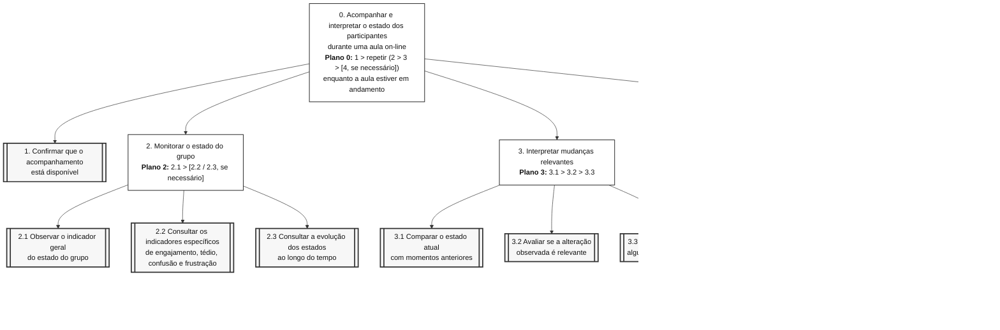

# Entrega 5 — Análise de tarefas: HTA, GOMS e CTT

**Data:** {{10/09/2026}}  
**Status:** 🟨  iniciada  
**Responsabilidade:** cada integrante modela pelo menos 1 HTA, 1 GOMS e 1 CTT. As três técnicas podem abordar a mesma funcionalidade ou funcionalidades distintas, conforme a orientação da disciplina.

## Objetivo da atividade

Modelar tarefas importantes sob perspectivas complementares: decomposição hierárquica (HTA), estrutura de metas/métodos/operações (GOMS) e relações temporais entre tarefas (CTT). O diagrama deve ser acompanhado de interpretação textual.

## Para projetos cujo TCC não previa interface

Modele **tarefas humanas relacionadas ao uso da contribuição técnica**, e não a implementação interna do algoritmo. Exemplos de boas tarefas para análise:

- investigar uma consulta de baixo desempenho;
- configurar uma análise e selecionar parâmetros;
- submeter um dataset e verificar sua validade;
- acompanhar uma execução demorada;
- comparar dois resultados/modelos;
- interpretar uma recomendação e decidir se a aceita;
- localizar uma execução anterior usando busca/filtros;
- gerar e compartilhar um relatório;
- administrar papéis/permissões quando isso for parte do trabalho real;
- revisar um alerta e registrar uma decisão.

Um CRUD pode gerar tarefas relevantes, mas “cadastrar usuário” só merece modelagem se tiver significado no domínio (papéis, validações, riscos, permissões, dependências).

## Seleção das tarefas

| ID | Tarefa | Persona/cenário de origem | Frequência/criticidade | Autor responsável |
|---|---|---|---|---|
| T01 | Acompanhar e interpretar o estado dos participantes durante uma aula on-line | P01 / C01 — Docente em uma aula EAD síncrona | Alta frequência / Alta criticidade | {{nome — matrícula}} |
| T02 | Interpretar os indicadores do MindFlow AI e decidir se deve adaptar a condução da aula | P01 / C01 — Docente em uma aula EAD síncrona | Alta frequência / Alta criticidade | {{nome — matrícula}} |
| T03 | Conduzir a aula enquanto acompanha e responde aos estados dos participantes | P01 / C01 — Docente em uma aula EAD síncrona | Alta frequência / Alta criticidade | {{nome — matrícula}} |

> Priorize tarefas necessárias para que o usuário alcance objetivos centrais. Não desperdice a modelagem em ações triviais isoladas, como “clicar em login”, se o objetivo relevante é maior. Da mesma forma, não modele o funcionamento interno do algoritmo como se fosse uma tarefa humana.

---

## HTA — T01 Acompanhar e interpretar o estado dos participantes durante uma aula on-line

**Autor(a):** Kayky - 22.222.040-2

### Descrição da tarefa

A tarefa tem como objetivo permitir que o docente acompanhe, durante uma aula on-line, os estados dos participantes apresentados pelo MindFlow AI, identificando mudanças relevantes de engajamento, tédio, confusão ou frustração e utilizando essas informações como apoio para decidir se deve adaptar a condução da aula.

A tarefa se inicia quando a aula está em andamento e o acompanhamento dos participantes está disponível no MindFlow AI. Durante a apresentação, consulta os indicadores sem interromper sua atividade principal de lecionar, interpreta alterações relevantes e, quando necessário, realiza alguma intervenção pedagógica, como modificar o ritmo, retomar uma explicação ou fazer uma pergunta à turma.

A tarefa é considerada concluída quando a aula termina. Durante sua execução, o ciclo de monitoramento, interpretação e possível intervenção pode ocorrer diversas vezes.

### Diagrama

### Decomposição e planos

| ID | Objetivo/operação | Plano/ordem | Problema ou decisão de design observada |
|---|---|---|---|
| 0 | Acompanhar e interpretar o estado dos participantes durante uma aula on-line | Docente precisa acompanhar os indicadores enquanto conduz a aula. A interface deve fornecer informação útil sem exigir atenção contínua ou competir excessivamente com a atividade de lecionar. |
| 1 | Confirmar que o acompanhamento está disponível | Executar antes de iniciar o ciclo de monitoramento | O sistema deve deixar evidente se o acompanhamento está ativo e se há dados disponíveis para a sessão. |
| 2 | Monitorar o estado do grupo | **2.1 > [2.2 / 2.3, conforme necessidade]** | A informação principal deve ser compreendida rapidamente. Detalhes adicionais devem estar disponíveis sem sobrecarregar a interface durante a aula. |
| 2.1 | Observar o indicador geral do estado do grupo | Operação principal de monitoramento | O estado predominante deve ser identificável rapidamente e não deve depender exclusivamente de cor para ser compreendido. |
| 2.2 | Consultar os indicadores específicos de engajamento, tédio, confusão e frustração | Executar quando o indicador geral não fornecer informação suficiente | A apresentação simultânea de muitos indicadores pode aumentar a carga cognitiva de Docente durante a aula. |
| 2.3 | Consultar a evolução dos estados ao longo do tempo | Executar quando for necessário compreender uma mudança ou tendência | O sistema deve facilitar a relação entre a alteração dos indicadores e o momento correspondente da aula. |
| 3 | Interpretar mudanças relevantes nos estados dos participantes | **3.1 > 3.2 > 3.3** | Pequenas oscilações não devem ser interpretadas automaticamente como necessidade de intervenção. A interface deve fornecer contexto para apoiar a interpretação. |
| 3.1 | Comparar o estado atual com momentos anteriores | Executar após perceber uma possível mudança | A comparação temporal deve ser simples e rápida, evitando exigir análise detalhada enquanto Docente conduz a aula. |
| 3.2 | Avaliar se a alteração observada é relevante | Executar após 3.1 | Os indicadores devem funcionar como apoio à interpretação e não como uma conclusão absoluta sobre o comportamento dos participantes. |
| 3.3 | Decidir se é necessária alguma intervenção na aula | Executar após 3.2 | A decisão sobre intervir deve permanecer com Docente. O sistema apresenta informações, mas não determina automaticamente a ação pedagógica. |
| 4 | Adaptar a condução da aula | **4.1 > 4.5 > retornar a 2**, somente quando 3.3 indicar necessidade de intervenção | A adaptação é condicional. O MindFlow auxilia na percepção da situação, mas a escolha da resposta pedagógica pertence à docente. |
| 4.1 | Escolher uma estratégia de intervenção | **4.2 / 4.3 / 4.4** | A estratégia escolhida depende da situação observada. Não existe uma única intervenção adequada para todos os estados. |
| 4.2 | Alterar o ritmo da apresentação | Alternativa de 4.1 | Pode ser utilizada quando houver indícios de queda de engajamento ou dificuldade dos participantes em acompanhar o ritmo atual. |
| 4.3 | Retomar ou reformular a explicação | Alternativa de 4.1 | Pode ser utilizada quando houver indícios de confusão ou dificuldade de compreensão do conteúdo. |
| 4.4 | Fazer uma pergunta aos participantes | Alternativa de 4.1 | Permite complementar os indicadores do sistema com uma resposta explícita dos participantes e confirmar a interpretação de Docente. |
| 4.5 | Verificar o comportamento dos indicadores após a intervenção | Executar após a estratégia selecionada em 4.1 | Docente precisa perceber se a intervenção realizada foi acompanhada por alguma alteração nos estados apresentados pelo MindFlow. Após essa verificação, o ciclo retorna ao monitoramento. |

**Verificação do HTA:**

- O objetivo 0 representa uma meta do usuário?
- As subtarefas são necessárias e suficientes?
- Os **planos** indicam ordem, alternativa, repetição ou condição?
- A decomposição parou em nível útil para projeto de interação?

---

## GOMS — T02 nterpretar os indicadores do MindFlow AI e decidir se deve adaptar a condução da aula

**Autor(a):** {{Kayky Pires — 22.222.040-2}}

### Goal

### GOAL 0: Interpretar os indicadores do MindFlow AI e decidir como prosseguir com a aula

---

### GOAL 1: Compreender o estado atual dos participantes

#### METHOD 1.A: Consultar o indicador geral

**SEL. RULE:** utilizar quando o usuário deseja obter rapidamente uma visão geral do estado predominante dos participantes.

- **OP. 1.A.1:** direcionar a atenção para o indicador geral;
- **OP. 1.A.2:** examinar o estado destacado;
- **OP. 1.A.3:** verificar o valor apresentado;
- **OP. 1.A.4:** interpretar o estado predominante.

#### METHOD 1.B: Consultar os indicadores específicos

**SEL. RULE:** utilizar quando o indicador geral não fornecer informação suficiente ou quando for necessário comparar engajamento, tédio, confusão e frustração.

- **OP. 1.B.1:** direcionar a atenção para os indicadores específicos;
- **OP. 1.B.2:** examinar os valores apresentados;
- **OP. 1.B.3:** comparar os diferentes estados;
- **OP. 1.B.4:** identificar quais estados apresentam maior intensidade.

---

### GOAL 2: Avaliar se existe uma mudança relevante

#### METHOD 2.A: Analisar a evolução temporal dos indicadores

**SEL. RULE:** utilizar quando for necessário verificar se o estado atual representa uma oscilação momentânea ou uma tendência ao longo da aula.

- **OP. 2.A.1:** consultar o gráfico temporal;
- **OP. 2.A.2:** localizar o momento atual da transmissão;
- **OP. 2.A.3:** comparar os valores atuais com momentos anteriores;
- **OP. 2.A.4:** identificar aumento, redução ou estabilidade dos estados;
- **OP. 2.A.5:** avaliar se a mudança é relevante.

#### METHOD 2.B: Confirmar a interpretação com os participantes

**SEL. RULE:** utilizar quando os indicadores não forem suficientes para interpretar a situação com segurança.

- **OP. 2.B.1:** formular uma pergunta relacionada ao momento da aula;
- **OP. 2.B.2:** solicitar retorno dos participantes;
- **OP. 2.B.3:** observar as respostas recebidas;
- **OP. 2.B.4:** comparar as respostas com os indicadores apresentados.

---

### GOAL 3: Definir como prosseguir com a aula

#### METHOD 3.A: Manter a condução atual

**SEL. RULE:** utilizar quando não houver mudança relevante ou quando os indicadores estiverem compatíveis com o comportamento esperado naquele momento.

- **OP. 3.A.1:** concluir que não é necessária intervenção;
- **OP. 3.A.2:** manter a condução atual;
- **OP. 3.A.3:** continuar acompanhando os indicadores.

#### METHOD 3.B: Alterar o ritmo da apresentação

**SEL. RULE:** utilizar quando houver indícios de queda de engajamento ou dificuldade de acompanhamento do ritmo atual.

- **OP. 3.B.1:** identificar a necessidade de ajuste;
- **OP. 3.B.2:** modificar o ritmo da apresentação;
- **OP. 3.B.3:** continuar a apresentação;
- **OP. 3.B.4:** observar novamente os indicadores.

#### METHOD 3.C: Retomar ou reformular a explicação

**SEL. RULE:** utilizar quando houver indícios relevantes de confusão ou dificuldade de compreensão.

- **OP. 3.C.1:** identificar o conteúdo relacionado ao momento de confusão;
- **OP. 3.C.2:** retomar ou reformular a explicação;
- **OP. 3.C.3:** prosseguir com o conteúdo;
- **OP. 3.C.4:** observar novamente os indicadores.

#### METHOD 3.D: Solicitar retorno direto dos participantes

**SEL. RULE:** utilizar quando houver dúvida sobre a interpretação dos indicadores ou quando for necessário obter confirmação explícita do grupo.

- **OP. 3.D.1:** formular uma pergunta;
- **OP. 3.D.2:** apresentar a pergunta aos participantes;
- **OP. 3.D.3:** observar as respostas;
- **OP. 3.D.4:** utilizar as respostas como apoio à decisão;
- **OP. 3.D.5:** definir como continuar a aula.

---

## Síntese do modelo GOMS

- **Goal principal:** acompanhar o estado dos participantes durante uma videoconferência.
- **Goals secundários:** identificar o estado predominante, identificar alterações relevantes e decidir se é necessário adaptar a apresentação.
- **Methods:** consultar indicador geral, consultar indicadores específicos, analisar gráfico temporal, continuar a apresentação ou adaptar sua condução.
- **Operators:** observar, examinar, comparar, interpretar, selecionar uma ação e continuar o monitoramento.
- **Selection Rules:** definem qual método deve ser utilizado conforme o contexto e as informações apresentadas pelo MindFlow AI.

## CTT — T03 {{nome da tarefa}}

**Autor(a):** {{nome — matrícula}}

### Descrição

A tarefa principal, **Conduzir aula com apoio do MindFlow**, é representada como uma tarefa abstrata e é decomposta em duas atividades principais: **Ministrar aula** e **Acompanhar estados dos participantes**. Essas tarefas possuem relação de concorrência (`|||`), pois Docente pode acompanhar as informações fornecidas pelo MindFlow enquanto continua conduzindo a aula.
O acompanhamento dos estados também é representado como uma tarefa abstrata. Inicialmente, o sistema executa a tarefa **Atualizar dashboard**, disponibilizando os indicadores referentes aos participantes. Por meio de uma relação de habilitação com passagem de informação (`[ ] >>`), esses dados tornam possível a tarefa interativa **Consultar estado do grupo**.
Após consultar as informações apresentadas pelo sistema, Docente realiza a tarefa **Interpretar estado observado**. A relação de habilitação (`>>`) indica que a interpretação ocorre a partir das informações consultadas anteriormente. Em seguida, a tarefa abstrata **Responder ao estado observado** representa as possíveis ações decorrentes dessa interpretação.
A resposta pode ocorrer por meio de uma escolha (`[ ]`) entre **Manter condução atual** e **Adaptar aula**. Quando uma das alternativas é iniciada, a outra é desabilitada naquele momento. Caso Docente considere que não é necessária uma intervenção, ela mantém a condução atual. Caso identifique necessidade de alteração, executa a tarefa abstrata **Adaptar aula**, que pode posteriormente ser decomposta em ações específicas, como alterar o ritmo, retomar uma explicação ou solicitar retorno dos participantes.
O acompanhamento não ocorre apenas uma vez. Enquanto a aula estiver em andamento, Docente pode repetir o ciclo de consulta, interpretação e resposta sempre que novas informações forem apresentadas pelo MindFlow. Dessa forma, o modelo representa a natureza contínua do acompanhamento sem tratar a atividade como uma sequência rígida de etapas.

### Diagrama

### Legenda e relações temporais usadas

| Operador/relação | Significado no diagrama | Exemplo no modelo |
|---|---|---|
| Nuvem | **Tarefa abstrata.** Representa uma composição de outras tarefas e é utilizada para organizar a decomposição hierárquica da atividade. | **Conduzir aula com apoio do MindFlow**, **Acompanhar estados**, **Responder ao estado observado** e **Adaptar aula**. |
| Retângulo | **Tarefa do usuário.** Representa uma atividade realizada diretamente pelo usuário, sem interação direta com o sistema naquele momento. | **Ministrar aula**, **Interpretar estado observado** e **Manter condução atual**. |
| Hexágono | **Tarefa do sistema.** Representa uma atividade executada pelo sistema sem interação direta do usuário. | **Atualizar dashboard**, realizada pelo MindFlow a partir dos dados processados durante a aula. |
| Círculo | **Tarefa interativa.** Representa uma atividade em que ocorre interação entre o usuário e o sistema. | **Consultar estado do grupo**, quando Docente observa as informações apresentadas no dashboard. |
| `|||` — Concorrência | Indica que duas tarefas podem ocorrer simultaneamente ou em qualquer ordem. | **Ministrar aula** `|||` **Acompanhar estados**, pois Docente acompanha os indicadores enquanto continua conduzindo a aula. |
| `[ ] >>` — Habilitação com passagem de informação | A segunda tarefa é habilitada após a primeira e utiliza informações produzidas por ela. | **Atualizar dashboard** `[ ] >>` **Consultar estado do grupo**. Os dados atualizados pelo sistema ficam disponíveis para consulta por Docente. |
| `>>` — Habilitação | Indica que a segunda tarefa pode ser iniciada após a conclusão da primeira. | **Consultar estado do grupo** `>>` **Interpretar estado observado** e **Interpretar estado observado** `>>` **Responder ao estado observado**. |
| `[ ]` — Escolha | Indica tarefas alternativas. Quando uma alternativa é iniciada, as demais alternativas daquela escolha são desabilitadas. | **Manter condução atual** `[ ]` **Adaptar aula**. Docente escolhe uma das respostas de acordo com o estado observado. |
| Repetição do acompanhamento | Indica que o conjunto de tarefas de acompanhamento pode ocorrer diversas vezes enquanto a aula estiver em andamento. | Após manter ou adaptar a condução da aula, Docente continua acompanhando os estados dos participantes durante a sessão. 

Identifique, quando aplicável, tarefas de usuário, sistema, interação e tarefas abstratas. Verifique se concorrência, escolha, habilitação, desabilitação e repetição estão representadas corretamente segundo a notação adotada em aula.

---

## Síntese da equipe

Quais problemas de interação, oportunidades e requisitos apareceram a partir das modelagens? Quais tarefas irão para o protótipo e para o teste de usabilidade?

## Checklist

- [ ] Cada integrante produziu ao menos 1 HTA, 1 GOMS e 1 CTT.
- [ ] Cada artefato identifica autor e tarefa.
- [ ] Diagramas são legíveis e possuem fonte editável quando possível.
- [ ] HTA contém planos, não apenas árvore de tópicos.
- [ ] GOMS distingue Goals, Operators, Methods e Selection Rules.
- [ ] CTT usa operadores temporais e tipos de tarefa coerentes.
- [ ] Há texto explicando cada diagrama.
- [ ] Tarefas estão ligadas a cenários/personas na rastreabilidade.
- [ ] Em TCC técnico, as tarefas descrevem o que a pessoa faz com a contribuição/resultados, não passos internos do código.
- [ ] CRUDs, relatórios, filtros e atividades administrativas foram escolhidos por relevância ao objetivo do usuário.
