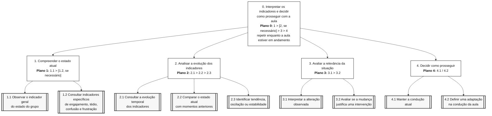
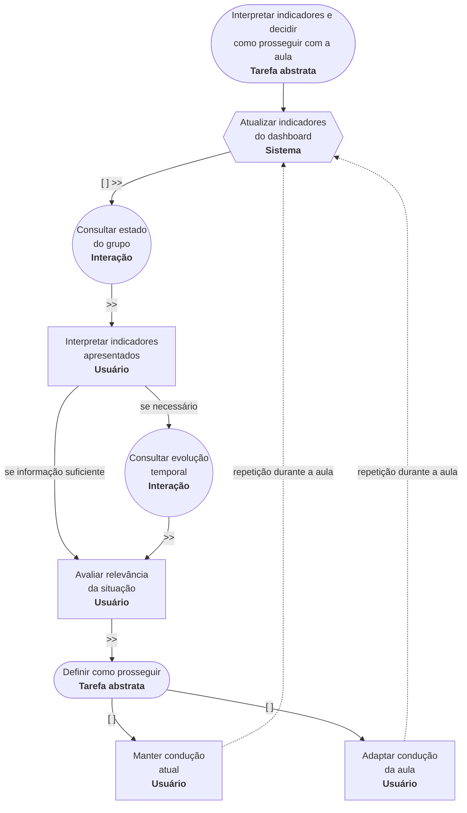

# Entrega 5 — Análise de tarefas: HTA, GOMS e CTT

**Data:** {{dd/mm/aaaa}}  
**Status:** ⬜ não iniciada  
**Responsabilidade:** cada integrante modela pelo menos 1 HTA, 1 GOMS e 1 CTT. As três técnicas podem abordar a mesma funcionalidade ou funcionalidades distintas, conforme a orientação da disciplina.

## Objetivo da atividade

Modelar tarefas importantes sob perspectivas complementares: decomposição hierárquica (HTA), estrutura de metas/métodos/operações (GOMS) e relações temporais entre tarefas (CTT). O diagrama deve ser acompanhado de interpretação textual.

## Para projetos cujo TCC não previa interface

Modele **tarefas humanas relacionadas ao uso da contribuição técnica**, e não a implementação interna do algoritmo. Exemplos de boas tarefas para análise:

- investigar uma consulta de baixo desempenho;
- configurar uma análise e selecionar parâmetros;
- submeter um dataset e verificar sua validade;
- acompanhar uma execução demorada;
- comparar dois resultados/modelos;
- interpretar uma recomendação e decidir se a aceita;
- localizar uma execução anterior usando busca/filtros;
- gerar e compartilhar um relatório;
- administrar papéis/permissões quando isso for parte do trabalho real;
- revisar um alerta e registrar uma decisão.

Um CRUD pode gerar tarefas relevantes, mas “cadastrar usuário” só merece modelagem se tiver significado no domínio (papéis, validações, riscos, permissões, dependências).

## Seleção das tarefas

| ID | Tarefa | Persona/cenário de origem | Frequência/criticidade | Autor responsável |
|---|---|---|---|---|
| T01 | Acompanhar e interpretar o estado dos participantes durante uma aula on-line | P01 / C01 — Docente em uma aula EAD síncrona | Alta frequência / Alta criticidade | {{nome — matrícula}} |
| T02 | Interpretar os indicadores do MindFlow AI e decidir se deve adaptar a condução da aula | P01 / C01 — Docente em uma aula EAD síncrona | Alta frequência / Alta criticidade | {{nome — matrícula}} |
| T03 | Conduzir a aula enquanto acompanha e responde aos estados dos participantes | P01 / C01 — Docente em uma aula EAD síncrona | Alta frequência / Alta criticidade | {{nome — matrícula}} |


> Priorize tarefas necessárias para que o usuário alcance objetivos centrais. Não desperdice a modelagem em ações triviais isoladas, como “clicar em login”, se o objetivo relevante é maior. Da mesma forma, não modele o funcionamento interno do algoritmo como se fosse uma tarefa humana.

---

# HTA — T02 Interpretar os indicadores do MindFlow AI e decidir se deve adaptar a condução da aula

**Autor(a):** Rafael Dias — 22.222.039-4

## Descrição da tarefa

A tarefa tem como objetivo permitir que o docente interprete os indicadores apresentados pelo MindFlow AI durante uma aula on-line e utilize essas informações como apoio para decidir se deve manter ou adaptar a condução da aula.

A tarefa se inicia quando o MindFlow AI apresenta os estados dos participantes no dashboard. O docente consulta o estado atual, compara os indicadores quando necessário, analisa sua evolução ao longo do tempo e avalia se a alteração observada é suficientemente relevante para justificar alguma mudança na aula.

A tarefa é concluída quando o docente decide manter a condução atual ou realizar uma adaptação. Esse processo pode se repetir diversas vezes durante a aula conforme novos estados são apresentados pelo sistema.

## Diagrama



## Decomposição e planos

| ID  | Objetivo/operação                                               | Plano/ordem                                                  | Problema ou decisão de design observada                                                                                  |
| --- | --------------------------------------------------------------- | ------------------------------------------------------------ | ------------------------------------------------------------------------------------------------------------------------ |
| 0   | Interpretar os indicadores e decidir como prosseguir com a aula | **1 > [2, se necessário] > 3 > 4**, repetindo durante a aula | O processo precisa ser rápido para não desviar excessivamente a atenção do docente da aula.                              |
| 1   | Compreender o estado atual                                      | **1.1 > [1.2, se necessário]**                               | A informação principal precisa ser percebida rapidamente, deixando detalhes disponíveis apenas quando forem necessários. |
| 1.1 | Observar o indicador geral do estado do grupo                   | Primeira operação                                            | O estado predominante deve ser facilmente identificável e não depender exclusivamente de cores.                          |
| 1.2 | Consultar indicadores específicos                               | Executar quando o indicador geral não for suficiente         | Exibir vários indicadores simultaneamente pode aumentar a carga cognitiva durante a aula.                                |
| 2   | Analisar a evolução dos indicadores                             | **2.1 > 2.2 > 2.3**                                          | Uma mudança pontual não deve ser automaticamente interpretada como tendência.                                            |
| 2.1 | Consultar a evolução temporal                                   | Primeira etapa da análise temporal                           | O histórico precisa permitir associação entre o momento da aula e a alteração observada.                                 |
| 2.2 | Comparar o estado atual com momentos anteriores                 | Após 2.1                                                     | A comparação precisa ser simples e rápida.                                                                               |
| 2.3 | Identificar tendência, oscilação ou estabilidade                | Após 2.2                                                     | O sistema deve oferecer contexto suficiente para evitar interpretações baseadas somente em um instante isolado.          |
| 3   | Avaliar a relevância da situação                                | **3.1 > 3.2**                                                | Os indicadores funcionam como apoio à decisão e não como uma conclusão absoluta sobre os participantes.                  |
| 3.1 | Interpretar a alteração observada                               | Após compreender os indicadores                              | O docente deve relacionar os dados ao contexto atual da aula.                                                            |
| 3.2 | Avaliar se a mudança justifica uma intervenção                  | Após 3.1                                                     | A decisão sobre intervir permanece com o docente.                                                                        |
| 4   | Decidir como prosseguir                                         | **4.1 / 4.2**                                                | A interface deve apoiar a decisão sem impor automaticamente uma ação pedagógica.                                         |
| 4.1 | Manter a condução atual                                         | Alternativa quando não houver necessidade de adaptação       | Pequenas oscilações podem não justificar alterações na aula.                                                             |
| 4.2 | Definir uma adaptação na condução da aula                       | Alternativa quando houver mudança considerada relevante      | A adaptação escolhida depende do contexto e do estado observado.     
**Verificação do HTA:**

- O objetivo 0 representa uma meta do usuário?
- As subtarefas são necessárias e suficientes?
- Os **planos** indicam ordem, alternativa, repetição ou condição?
- A decomposição parou em nível útil para projeto de interação?

---

# GOMS — T02 Interpretar os indicadores do MindFlow AI e decidir se deve adaptar a condução da aula

**Autor(a):** Rafael Dias — 22.222.039-4

## GOAL 0: Interpretar os indicadores do MindFlow AI e decidir como prosseguir com a aula

---

## GOAL 1: Compreender o estado atual dos participantes

### METHOD 1.A: Consultar o indicador geral

**SEL. RULE:** utilizar como primeira forma de consulta, quando o docente precisa compreender rapidamente o estado predominante do grupo.

* **OP. 1.A.1:** direcionar a atenção para o indicador geral;
* **OP. 1.A.2:** identificar o estado predominante apresentado;
* **OP. 1.A.3:** verificar o valor associado ao estado;
* **OP. 1.A.4:** interpretar a informação apresentada.

### METHOD 1.B: Consultar os indicadores específicos

**SEL. RULE:** utilizar quando o indicador geral não fornecer informação suficiente ou quando for necessário compreender melhor a composição dos estados apresentados.

* **OP. 1.B.1:** acessar os indicadores específicos;
* **OP. 1.B.2:** observar os valores de engajamento, tédio, confusão e frustração;
* **OP. 1.B.3:** comparar os valores;
* **OP. 1.B.4:** identificar os estados de maior intensidade.

---

## GOAL 2: Verificar se houve uma mudança relevante

### METHOD 2.A: Comparar com momentos anteriores

**SEL. RULE:** utilizar quando o estado atual aparentar diferença em relação ao que vinha sendo apresentado anteriormente.

* **OP. 2.A.1:** consultar a evolução temporal;
* **OP. 2.A.2:** localizar o momento atual;
* **OP. 2.A.3:** observar os valores anteriores;
* **OP. 2.A.4:** comparar os valores atuais com os anteriores;
* **OP. 2.A.5:** identificar aumento, redução ou estabilidade.

### METHOD 2.B: Considerar somente o estado atual

**SEL. RULE:** utilizar quando o indicador estiver estável e não houver evidência de uma alteração que exija análise histórica.

* **OP. 2.B.1:** verificar o estado atual;
* **OP. 2.B.2:** reconhecer que não há alteração relevante;
* **OP. 2.B.3:** prosseguir para a decisão.

---

## GOAL 3: Interpretar a situação

### METHOD 3.A: Relacionar os indicadores ao contexto da aula

**SEL. RULE:** utilizar após a consulta dos indicadores para avaliar se a informação apresentada possui significado no momento atual da aula.

* **OP. 3.A.1:** identificar o conteúdo ou atividade realizada naquele momento;
* **OP. 3.A.2:** relacionar o contexto aos estados apresentados;
* **OP. 3.A.3:** avaliar a intensidade da alteração;
* **OP. 3.A.4:** determinar se a mudança é relevante.

---

## GOAL 4: Decidir como prosseguir com a aula

### METHOD 4.A: Manter a condução atual

**SEL. RULE:** utilizar quando não houver alteração relevante ou quando os indicadores estiverem compatíveis com a situação esperada naquele momento.

* **OP. 4.A.1:** concluir que não é necessária intervenção;
* **OP. 4.A.2:** manter a condução atual da aula;
* **OP. 4.A.3:** continuar acompanhando os indicadores.

### METHOD 4.B: Adaptar a condução da aula

**SEL. RULE:** utilizar quando o docente interpretar que a alteração dos indicadores é relevante e pode exigir uma mudança na condução da aula.

* **OP. 4.B.1:** reconhecer a necessidade de intervenção;
* **OP. 4.B.2:** selecionar uma estratégia adequada;
* **OP. 4.B.3:** realizar a adaptação;
* **OP. 4.B.4:** continuar acompanhando os indicadores.

---

## Síntese do modelo GOMS

* **Goal principal:** interpretar os indicadores do MindFlow AI e decidir como prosseguir com a aula.
* **Goals secundários:** compreender o estado atual, identificar mudanças relevantes, interpretar a situação e definir como continuar.
* **Methods:** consultar indicador geral, consultar indicadores específicos, comparar valores no tempo, manter a condução ou adaptar a aula.
* **Operators:** observar, acessar, identificar, comparar, interpretar, relacionar informações, decidir e selecionar uma ação.
* **Selection Rules:** determinam qual método é utilizado de acordo com a quantidade de informação necessária, a existência de mudanças nos indicadores e a interpretação do docente.

> Não chame qualquer passo de “método”. Em GOMS, métodos são sequências alternativas capazes de atingir uma meta; regras de seleção explicam quando escolher entre eles.

---

# CTT — T02 Interpretar os indicadores do MindFlow AI e decidir se deve adaptar a condução da aula

**Autor(a):** Rafael Dias — 22.222.039-4

## Descrição

O CTT representa o processo de interpretação dos indicadores apresentados pelo MindFlow AI e a decisão do docente sobre como prosseguir com a aula.

O sistema inicialmente **atualiza os indicadores do dashboard**. A partir das informações disponibilizadas, o docente **consulta o estado do grupo** e **interpreta os indicadores apresentados**.

Quando considerar necessário obter mais contexto, pode **consultar a evolução temporal dos estados** antes de avaliar a relevância da situação. Após essa interpretação, o docente decide entre **manter a condução atual** ou **adaptar a aula**.

Como os indicadores são atualizados ao longo da sessão, esse processo pode ser repetido diversas vezes durante a aula.

## Diagrama



## Estrutura temporal simplificada

```text
Atualizar indicadores
    [ ] >>
Consultar estado do grupo
    >>
Interpretar indicadores
    >>
[ Consultar evolução temporal, se necessário ]
    >>
Avaliar relevância da situação
    >>
(
    Manter condução atual
    [ ]
    Adaptar condução da aula
)

Após a decisão, o ciclo pode ser repetido enquanto a aula estiver em andamento.
```

## Legenda e relações temporais

| Operador/relação  | Significado no modelo                                    | Aplicação na T02                                                                                              |
| ----------------- | -------------------------------------------------------- | ------------------------------------------------------------------------------------------------------------- |
| Tarefa abstrata   | Agrupa tarefas relacionadas a um objetivo maior          | **Interpretar indicadores e decidir como prosseguir** e **Definir como prosseguir**                           |
| Tarefa do usuário | Ação realizada pelo docente                              | **Interpretar indicadores**, **Avaliar relevância**, **Manter condução atual** e **Adaptar condução da aula** |
| Tarefa do sistema | Atividade executada automaticamente pelo MindFlow AI     | **Atualizar indicadores do dashboard**                                                                        |
| Tarefa interativa | Atividade que envolve interação entre usuário e sistema  | **Consultar estado do grupo** e **Consultar evolução temporal**                                               |
| `[ ] >>`          | Habilitação com passagem de informação                   | O sistema atualiza os indicadores e essas informações ficam disponíveis para consulta                         |
| `>>`              | Habilitação                                              | A interpretação ocorre após a consulta dos indicadores e a decisão ocorre após sua avaliação                  |
| `[ ]`             | Escolha                                                  | O docente decide entre **manter a condução atual** ou **adaptar a aula**                                      |
| Condição          | Determina que uma tarefa ocorre apenas quando necessária | A evolução temporal é consultada quando o estado atual não oferece contexto suficiente                        |
| Repetição         | Permite executar novamente o conjunto de tarefas         | Após a decisão, novos indicadores podem iniciar outro ciclo de interpretação durante a aula  

Identifique, quando aplicável, tarefas de usuário, sistema, interação e tarefas abstratas. Verifique se concorrência, escolha, habilitação, desabilitação e repetição estão representadas corretamente segundo a notação adotada em aula.

---

## Síntese da equipe

Quais problemas de interação, oportunidades e requisitos apareceram a partir das modelagens? Quais tarefas irão para o protótipo e para o teste de usabilidade?

## Checklist

- [ ] Cada integrante produziu ao menos 1 HTA, 1 GOMS e 1 CTT.
- [ ] Cada artefato identifica autor e tarefa.
- [ ] Diagramas são legíveis e possuem fonte editável quando possível.
- [ ] HTA contém planos, não apenas árvore de tópicos.
- [ ] GOMS distingue Goals, Operators, Methods e Selection Rules.
- [ ] CTT usa operadores temporais e tipos de tarefa coerentes.
- [ ] Há texto explicando cada diagrama.
- [ ] Tarefas estão ligadas a cenários/personas na rastreabilidade.
- [ ] Em TCC técnico, as tarefas descrevem o que a pessoa faz com a contribuição/resultados, não passos internos do código.
- [ ] CRUDs, relatórios, filtros e atividades administrativas foram escolhidos por relevância ao objetivo do usuário.
