# Entrega 5 — Análise de tarefas: HTA, GOMS e CTT

**Data:** {{dd/mm/aaaa}}  
**Status:** ⬜ não iniciada  
**Responsabilidade:** cada integrante modela pelo menos 1 HTA, 1 GOMS e 1 CTT. As três técnicas podem abordar a mesma funcionalidade ou funcionalidades distintas, conforme a orientação da disciplina.

## Objetivo da atividade

Modelar tarefas importantes sob perspectivas complementares: decomposição hierárquica (HTA), estrutura de metas/métodos/operações (GOMS) e relações temporais entre tarefas (CTT). O diagrama deve ser acompanhado de interpretação textual.

## Para projetos cujo TCC não previa interface

Modele **tarefas humanas relacionadas ao uso da contribuição técnica**, e não a implementação interna do algoritmo. Exemplos de boas tarefas para análise:

- investigar uma consulta de baixo desempenho;
- configurar uma análise e selecionar parâmetros;
- submeter um dataset e verificar sua validade;
- acompanhar uma execução demorada;
- comparar dois resultados/modelos;
- interpretar uma recomendação e decidir se a aceita;
- localizar uma execução anterior usando busca/filtros;
- gerar e compartilhar um relatório;
- administrar papéis/permissões quando isso for parte do trabalho real;
- revisar um alerta e registrar uma decisão.

Um CRUD pode gerar tarefas relevantes, mas “cadastrar usuário” só merece modelagem se tiver significado no domínio (papéis, validações, riscos, permissões, dependências).

## Seleção das tarefas

| ID | Tarefa | Persona/cenário de origem | Frequência/criticidade | Autor responsável |
|---|---|---|---|---|
| T01 | Acompanhar e interpretar o estado dos participantes durante uma aula on-line | P01 / C01 — Karol em uma aula EAD síncrona | Alta frequência / Alta criticidade | {{nome — matrícula}} |
| T02 | Interpretar os indicadores do MindFlow AI e decidir se deve adaptar a condução da aula | P01 / C01 — Karol em uma aula EAD síncrona | Alta frequência / Alta criticidade | {{nome — matrícula}} |
| T03 | Conduzir a aula enquanto acompanha e responde aos estados dos participantes | P01 / C01 — Karol em uma aula EAD síncrona | Alta frequência / Alta criticidade | {{nome — matrícula}} |

> Priorize tarefas necessárias para que o usuário alcance objetivos centrais. Não desperdice a modelagem em ações triviais isoladas, como “clicar em login”, se o objetivo relevante é maior. Da mesma forma, não modele o funcionamento interno do algoritmo como se fosse uma tarefa humana.

---

## HTA — T01 {{nome da tarefa}}

**Autor(a):** {{nome — matrícula}}

### Descrição da tarefa

A tarefa tem como objetivo permitir que Karol acompanhe, durante uma aula on-line, os estados dos participantes apresentados pelo MindFlow AI, identificando mudanças relevantes de engajamento, tédio, confusão ou frustração e utilizando essas informações como apoio para decidir se deve adaptar a condução da aula.

A tarefa se inicia quando a aula está em andamento e o acompanhamento dos participantes está disponível no MindFlow AI. Durante a apresentação, Karol consulta os indicadores sem interromper sua atividade principal de lecionar, interpreta alterações relevantes e, quando necessário, realiza alguma intervenção pedagógica, como modificar o ritmo, retomar uma explicação ou fazer uma pergunta à turma.

A tarefa é considerada concluída quando a aula termina. Durante sua execução, o ciclo de monitoramento, interpretação e possível intervenção pode ocorrer diversas vezes.

### Diagrama

```mermaid
flowchart TB

    %% =========================
    %% OBJETIVO PRINCIPAL
    %% =========================

    T0["0. Acompanhar o estado dos participantes<br/>durante uma videoconferência<br/><b>Plano 0:</b> 1 > 2 > 4<br/>"]

    %% =========================
    %% NÍVEL 1
    %% =========================

    T1["1. Preparar o acompanhamento<br/><b>Plano 1:</b> 1.1 > 1.2 > 1.3"]

    T2["2. Monitorar os estados dos participantes<br/><b>Plano 2:</b> 2.1 + 2.2"]

    T3["3. Adaptar a apresentação quando necessário<br/><b>Plano 3:</b> 3.1 > 3.2"]

    T4["4. Revisar os dados após a transmissão<br/><b>Plano 4:</b> 4.1 > 4.2 > 4.3"]

    T0 --> T1
    T0 --> T2
    T0 --> T3
    T0 --> T4

    %% =========================
    %% TAREFA 1
    %% =========================

    T11[["1.1 Acessar o MindFlow AI"]]
    T12[["1.2 Selecionar ou iniciar<br/>a transmissão"]]
    T13[["1.3 Verificar se o acompanhamento<br/>está ativo"]]

    T1 --> T11
    T1 --> T12
    T1 --> T13

    %% =========================
    %% TAREFA 2
    %% =========================

    T21["2.1 Observar o estado predominante<br/><b>Plano 2.1:</b> 2.1.1 / 2.1.2 / 2.1.3 / 2.1.4"]

    T22["2.2 Acompanhar a evolução temporal<br/><b>Plano 2.2:</b> 2.2.1 > 2.2.2"]

    T2 --> T21
    T2 --> T22

    T211[["2.1.1 Verificar engajamento"]]
    T212[["2.1.2 Verificar tédio"]]
    T213[["2.1.3 Verificar confusão"]]
    T214[["2.1.4 Verificar frustração"]]

    T21 --> T211
    T21 --> T212
    T21 --> T213
    T21 --> T214

    T221[["2.2.1 Observar variações<br/>dos indicadores"]]
    T222[["2.2.2 Identificar mudanças<br/>relevantes ao longo da sessão"]]

    T22 --> T221
    T22 --> T222

    %% =========================
    %% TAREFA 3
    %% =========================

    T31[["3.1 Identificar necessidade<br/>de intervenção"]]

    T32["3.2 Escolher uma ação<br/><b>Plano 3.2:</b> 3.2.1 / 3.2.2 / 3.2.3"]

    T3 --> T31
    T3 --> T32

    T321[["3.2.1 Alterar o ritmo<br/>da apresentação"]]
    T322[["3.2.2 Retomar ou explicar<br/>novamente o conteúdo"]]
    T323[["3.2.3 Fazer perguntas<br/>aos participantes"]]

    T32 --> T321
    T32 --> T322
    T32 --> T323

    %% =========================
    %% TAREFA 4
    %% =========================

    T41[["4.1 Acessar o histórico<br/>de transmissões"]]
    T42[["4.2 Selecionar a transmissão<br/>que deseja analisar"]]

    T43["4.3 Analisar o comportamento da sessão<br/><b>Plano 4.3:</b> 4.3.1 + 4.3.2"]

    T4 --> T41
    T4 --> T42
    T4 --> T43

    T431[["4.3.1 Identificar períodos de maior<br/>ou menor engajamento"]]
    T432[["4.3.2 Relacionar as variações<br/>aos momentos da apresentação"]]

    T43 --> T431
    T43 --> T432

    %% =========================
    %% ESTILOS
    %% =========================

    classDef objetivo fill:#ffffff,stroke:#333,stroke-width:1.5px,color:#111;
    classDef operacao fill:#f7f7f7,stroke:#333,stroke-width:2.5px,color:#111;

    class T0,T1,T2,T3,T4,T21,T22,T32,T43 objetivo;
    class T11,T12,T13,T211,T212,T213,T214,T221,T222,T31,T321,T322,T323,T41,T42,T431,T432 operacao;
```

### Decomposição e planos

| ID | Objetivo/operação | Plano/ordem | Problema ou decisão de design observada |
|---|---|---|---|
| 0 | Acompanhar e interpretar o estado dos participantes durante uma aula on-line | **1 > repetir (2 > 3 > [4, se necessário]) enquanto a aula estiver em andamento** | Karol precisa acompanhar os indicadores ao mesmo tempo em que conduz a aula. A interface não deve exigir atenção contínua ou competir excessivamente com a apresentação. |
| 1 | Confirmar que o acompanhamento está disponível | Executar antes de iniciar o ciclo de monitoramento | O usuário deve conseguir perceber rapidamente se o sistema está recebendo e apresentando dados da sessão. |
| 2 | Monitorar o estado do grupo | **2.1 > (2.2 / 2.3, conforme necessidade)** | As informações principais devem ser compreendidas rapidamente, evitando sobrecarga de informações durante a aula. |
| 2.1 | Observar o indicador geral do estado do grupo | Operação principal de monitoramento | O estado predominante deve ser identificável rapidamente e não depender exclusivamente de cor para ser compreendido. |
| 2.2 | Consultar os indicadores específicos de engajamento, tédio, confusão e frustração | Executar quando o indicador geral não fornecer informação suficiente | Exibir muitos indicadores simultaneamente pode aumentar a carga cognitiva durante a apresentação. |
| 2.3 | Consultar a evolução dos estados ao longo do tempo | Executar quando houver necessidade de compreender uma mudança ou tendência | O usuário precisa relacionar a alteração apresentada pelo sistema ao momento correspondente da aula. |
| 3 | Interpretar mudanças relevantes nos estados dos participantes | **3.1 > 3.2 > 3.3** | Uma pequena oscilação não deve necessariamente provocar uma intervenção. É necessário fornecer contexto suficiente para apoiar a interpretação. |
| 3.1 | Comparar o estado atual com momentos anteriores | Executar após perceber uma possível mudança | A interface deve facilitar a comparação temporal sem exigir análise complexa durante a aula. |
| 3.2 | Avaliar se a alteração observada é relevante | Executar após 3.1 | Deve ficar claro que os indicadores servem como apoio à decisão e não representam uma interpretação absoluta do comportamento dos participantes. |
| 3.3 | Decidir se é necessária alguma intervenção na aula | Executar após 3.2 | A decisão final deve permanecer com o docente, evitando que o sistema determine automaticamente como ele deve conduzir a aula. |
| 4 | Adaptar a condução da aula | Executar somente quando 3.3 indicar necessidade de intervenção | O MindFlow deve apoiar a percepção do problema, mas a escolha da estratégia pedagógica pertence ao docente. |
| 4.1 | Escolher uma estratégia de intervenção | **4.2 / 4.3 / 4.4** | Diferentes estados podem demandar respostas diferentes; não existe uma única intervenção adequada para todas as situações. |
| 4.2 | Alterar o ritmo da apresentação | Alternativa de 4.1 | Pode ser utilizada quando Karol perceber queda de engajamento ou sinais de dificuldade de acompanhamento. |
| 4.3 | Retomar ou reformular a explicação | Alternativa de 4.1 | Pode ser utilizada quando houver indícios de confusão ou dificuldade de compreensão. |
| 4.4 | Fazer uma pergunta aos participantes | Alternativa de 4.1 | Permite complementar os indicadores do sistema com uma resposta explícita dos participantes. |
| 4.5 | Verificar o comportamento dos indicadores após a intervenção | **4.1 > (4.2 / 4.3 / 4.4) > 4.5 > retornar a 2** | É necessário permitir que o docente perceba se a intervenção foi acompanhada por alguma mudança nos estados apresentados. |

**Verificação do HTA:**

- O objetivo 0 representa uma meta do usuário?
- As subtarefas são necessárias e suficientes?
- Os **planos** indicam ordem, alternativa, repetição ou condição?
- A decomposição parou em nível útil para projeto de interação?

---

## GOMS — T02 {{Acompanhar Engajamento}}

**Autor(a):** {{Kayky Pires — 22.222.040-2}}

### Goal

### GOAL 0: Acompanhar o estado dos participantes durante uma videoconferência

#### GOAL 1: Identificar o estado predominante dos participantes

##### METHOD 1.A: Consultar o indicador geral em tempo real

**SEL. RULE:** utilizar quando o usuário deseja obter rapidamente uma percepção geral do estado predominante dos participantes durante a videoconferência.

- **OP. 1.A.1:** direcionar a atenção para o indicador geral;
- **OP. 1.A.2:** examinar o estado destacado pelo sistema;
- **OP. 1.A.3:** verificar o valor apresentado;
- **OP. 1.A.4:** interpretar o estado predominante.

##### METHOD 1.B: Consultar os indicadores específicos de cada estado

**SEL. RULE:** utilizar quando o indicador geral não for suficiente ou quando o usuário desejar comparar engajamento, tédio, confusão e frustração.

- **OP. 1.B.1:** direcionar a atenção para os indicadores de estado;
- **OP. 1.B.2:** examinar o indicador de engajamento;
- **OP. 1.B.3:** examinar o indicador de tédio;
- **OP. 1.B.4:** examinar o indicador de confusão;
- **OP. 1.B.5:** examinar o indicador de frustração;
- **OP. 1.B.6:** comparar os valores apresentados;
- **OP. 1.B.7:** identificar o estado predominante.

##### METHOD 1.C: Consultar o gráfico de evolução temporal

**SEL. RULE:** utilizar quando o usuário perceber uma mudança relevante, tiver dúvida sobre o estado atual ou quiser analisar a evolução dos indicadores ao longo da transmissão.

- **OP. 1.C.1:** direcionar o cursor para o gráfico de evolução;
- **OP. 1.C.2:** examinar as linhas correspondentes aos estados;
- **OP. 1.C.3:** localizar o momento atual da transmissão;
- **OP. 1.C.4:** comparar os valores atuais com os anteriores;
- **OP. 1.C.5:** identificar aumento ou redução dos estados.

---

#### GOAL 2: Identificar uma alteração relevante no estado dos participantes

##### METHOD 2.A: Identificar alteração pelo indicador geral

**SEL. RULE:** utilizar quando houver mudança perceptível no estado predominante apresentado pelo sistema.

- **OP. 2.A.1:** observar mudança no indicador geral;
- **OP. 2.A.2:** identificar o novo estado predominante;
- **OP. 2.A.3:** verificar a intensidade da alteração.

##### METHOD 2.B: Identificar alteração pelo gráfico temporal

**SEL. RULE:** utilizar quando a mudança não estiver clara apenas pelo indicador geral ou quando for necessário compreender sua evolução ao longo da transmissão.

- **OP. 2.B.1:** examinar o gráfico temporal;
- **OP. 2.B.2:** localizar o ponto de alteração;
- **OP. 2.B.3:** verificar qual estado apresentou maior variação;
- **OP. 2.B.4:** comparar o momento atual com os momentos anteriores.

---

#### GOAL 3: Decidir se é necessário adaptar a apresentação

##### METHOD 3.A: Continuar a apresentação sem alteração

**SEL. RULE:** utilizar quando os indicadores permanecerem dentro do comportamento esperado e não houver alteração relevante nos estados dos participantes.

- **OP. 3.A.1:** interpretar os indicadores apresentados;
- **OP. 3.A.2:** concluir que não é necessária intervenção;
- **OP. 3.A.3:** continuar a apresentação.

##### METHOD 3.B: Adaptar a apresentação

**SEL. RULE:** utilizar quando houver aumento relevante de tédio, confusão ou frustração, ou redução relevante do engajamento.

- **OP. 3.B.1:** identificar o estado que motivou a intervenção;
- **OP. 3.B.2:** selecionar uma estratégia de adaptação;
- **OP. 3.B.3:** alterar o ritmo, retomar o conteúdo ou realizar uma pergunta;
- **OP. 3.B.4:** continuar monitorando os indicadores;
- **OP. 3.B.5:** verificar se houve alteração nos indicadores após a intervenção.

---

## Síntese do modelo GOMS

- **Goal principal:** acompanhar o estado dos participantes durante uma videoconferência.
- **Goals secundários:** identificar o estado predominante, identificar alterações relevantes e decidir se é necessário adaptar a apresentação.
- **Methods:** consultar indicador geral, consultar indicadores específicos, analisar gráfico temporal, continuar a apresentação ou adaptar sua condução.
- **Operators:** observar, examinar, comparar, interpretar, selecionar uma ação e continuar o monitoramento.
- **Selection Rules:** definem qual método deve ser utilizado conforme o contexto e as informações apresentadas pelo MindFlow AI.

## CTT — T03 {{nome da tarefa}}

**Autor(a):** {{nome — matrícula}}

### Descrição

{{...}}

### Diagrama

### Legenda e relações temporais usadas

| Operador/relação | Significado no diagrama | Exemplo no modelo |
|---|---|---|
| {{...}} | {{...}} | {{...}} |

Identifique, quando aplicável, tarefas de usuário, sistema, interação e tarefas abstratas. Verifique se concorrência, escolha, habilitação, desabilitação e repetição estão representadas corretamente segundo a notação adotada em aula.

---

## Síntese da equipe

Quais problemas de interação, oportunidades e requisitos apareceram a partir das modelagens? Quais tarefas irão para o protótipo e para o teste de usabilidade?

## Checklist

- [ ] Cada integrante produziu ao menos 1 HTA, 1 GOMS e 1 CTT.
- [ ] Cada artefato identifica autor e tarefa.
- [ ] Diagramas são legíveis e possuem fonte editável quando possível.
- [ ] HTA contém planos, não apenas árvore de tópicos.
- [ ] GOMS distingue Goals, Operators, Methods e Selection Rules.
- [ ] CTT usa operadores temporais e tipos de tarefa coerentes.
- [ ] Há texto explicando cada diagrama.
- [ ] Tarefas estão ligadas a cenários/personas na rastreabilidade.
- [ ] Em TCC técnico, as tarefas descrevem o que a pessoa faz com a contribuição/resultados, não passos internos do código.
- [ ] CRUDs, relatórios, filtros e atividades administrativas foram escolhidos por relevância ao objetivo do usuário.
